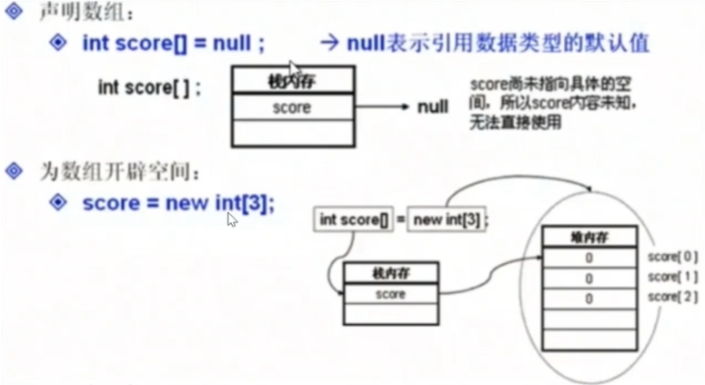

# 1. 前言
## 1.1 概述
- `Java`源代码是`*.java`的纯文本文件
- `JDK`是`Java`语言开发包，将`*.java`编译为**可执行Java程序**，其需要在**Java虚拟机**（`JVM`）中才可以运行
  - `Jar`打包工具、编译器、`Javadoc`文档生成器、`Debug`调试器等
  - `javac.exe`将 `*.java`文件**编译**为 `*.class`文件；然后用`java.exe`**解释**运行编译好的 `*.class`文件
- `JRE`是运行`Java`程序必须的环境的集合，包含`JVM`标准实现及`Java`核心类库，**仅能运行，不能编译调试**
- `JDK`包含`JRE`，`JRE`包含`JVM`

## 1.2 基础语法
- 标识符
  - 类、包、变量、方法的名字由任意顺序的大小写字母、数字、下划线、**美元符号**(`$`)组成
  - **不能包含空格**
  - **不能以数字开头**
  - **不能是保留关键字**
  - 不能有`-`、`#`等符号
- 常量：不可改变
  - `final double PI = 3.14；`
- 字面量
  - 变量和常量中存放的具体**数据**
- 变量的作用域
  - 成员变量：在类的内部、方法的外部声明
    - **整个类**
  - 局部变量：在方法的内部或方法体的某一个代码块内部声明
    - **方法体or代码块**
  - 两者其余区别
    - **初始值不同**：Java不会给局部变量赋初始值
    - **同名时，局部变量优先级更高**
- 基本数据类型
  - 整数类型：`byte`, `short`, `int`, `long`
    - **默认整数计算的结果**是`int`
    - 用`long`，要在**字面值末尾**加`L`(或`l`)
  - 小数类型：`float`, `double`
    - 小数默认类型是double
    -  用`float`，要在**字面值末尾**加`F`(或`f`)
  - 字符类型：`char`的**字面量可以是1个汉字**、英文字母、字符
    - 底层是按照`Unicode`编码
- 引用类型
  - 包括**数组、类、接口**
  - 传递的是**数据在内存中的地址**
- 强转换：**大——>小**
  - `char c2 = (char) c1`
- 注意`Java`中的整数除法
  - `(24+11)/4%3`结果是`2`，而不是2.75
- 逻辑运算优先级
  - 非 > 与 > 或
  - 关系运算优先级高于所有逻辑运算
- 数组
  - 声明数组  
    - `int score[]`
    - `int[] score`
  - 数组实例化
    - `score = new int[3]`
  - 初始化
    - 动态初始化：默认值0
    - 静态初始化：`int score[] = {2,5,6,4,5,7,9,10}`
  - 二维数组
    - 声明：`type name[][]`
    - 动态初始化：`arrayName[][] = new type[行][列]`
    - 静态初始化：`type name[][] = {{values},{valuess}}`


  

- `while`循环
  - 只要布尔表达式为 true，循环就会一直执行下去

```JAVA
while( 布尔表达式 ) {
  //循环内容
}
```

- `do…while` 循环
  - 至少会执行一次
  - 如果不满足条件，则不能进入循环

```JAVA
do {
       //代码语句
}while(布尔表达式);
```

- `for`循环
  - 初始化——>检测布尔表达式的值，如果为 `true`，执行——>更新——>检测布尔表达式的值，如果为 `true`，执行——>`....`

```JAVA
for(初始化; 布尔表达式; 更新) {
    //代码语句
}
```
- 主要用于数组的增强型 `for` 循环
  - **声明语句**：声明新的局部变量，该变量的类型必须和数组元素的类型匹配
  - **表达式**：表达式是要访问的数组名，**或者是返回值为数组的方法**

```JAVA
for(声明语句 : 表达式)
{
   //代码句子
}
```
```JAVA
String [] names ={"James", "Larry", "Tom", "Lacy"};
      for( String name : names ) {
         System.out.print( name );
         System.out.print(",");
      }
```

- 条件语句

```JAVA
if(布尔表达式 1){
   //如果布尔表达式 1的值为true执行代码
}else if(布尔表达式 2){
   //如果布尔表达式 2的值为true执行代码
}else if(布尔表达式 3){
   //如果布尔表达式 3的值为true执行代码
}else {
   //如果以上布尔表达式都不为true执行代码
}
```
- `switch case` 语句
  - 如果 `case` 语句块中没有 `break` 语句时，匹配成功后，从当前 `case` 开始，后续所有 `case` 的值都会输出;匹配不成功则返回默认 `case`

```JAVA
switch(expression){
    case value :
       //语句
       break; //可选
    case value :
       //语句
       break; //可选
    //你可以有任意数量的case语句
    default : //可选
       //语句
}
```

# 2. 面向对象
