# 1. 前言
## 1.1 概述
- `Java`源代码是`*.java`的纯文本文件
- `JDK`是`Java`语言开发包，将`*.java`编译为**可执行Java程序**，其需要在**Java虚拟机**（`JVM`）中才可以运行
  - `Jar`打包工具、编译器、`Javadoc`文档生成器、`Debug`调试器等
  - `javac.exe`将 `*.java`文件**编译**为 `*.class`文件；然后用`java.exe`**解释**运行编译好的 `*.class`文件
- `JRE`是运行`Java`程序必须的环境的集合，包含`JVM`标准实现及`Java`核心类库，**仅能运行，不能编译调试**
- `JDK`包含`JRE`，`JRE`包含`JVM`

## 1.2 基础语法
- 标识符
  - 类、包、变量、方法的名字由任意顺序的大小写字母、数字、下划线、**美元符号**(`$`)组成
  - **不能包含空格**
  - **不能以数字开头**
  - **不能是保留关键字**
  - 不能有`-`、`#`等符号
- 常量：不可改变
  - `final double PI = 3.14；`
- 字面量
  - 变量和常量中存放的具体**数据**
- 变量的作用域
  - 成员变量：在类的内部、方法的外部声明
    - **整个类**
  - 局部变量：在方法的内部或方法体的某一个代码块内部声明
    - **方法体or代码块**
  - 两者其余区别
    - **初始值不同**：Java不会给局部变量赋初始值
    - **同名时，局部变量优先级更高**
- 基本数据类型
  - 整数类型：`byte`, `short`, `int`, `long`
    - **默认整数计算的结果**是`int`
    - 用`long`，要在**字面值末尾**加`L`(或`l`)
  - 小数类型：`float`, `double`
    - 小数默认类型是double
    -  用`float`，要在**字面值末尾**加`F`(或`f`)
  - 字符类型：`char`的**字面量可以是1个汉字**、英文字母、字符
    - 底层是按照`Unicode`编码
- 引用类型
  - 包括**数组、类、接口**
  - 传递的是**数据在内存中的地址**
- 强转换：**大——>小**
  - `char c2 = (char) c1`
- 注意`Java`中的整数除法
  - `(24+11)/4%3`结果是`2`，而不是2.75
- 逻辑运算优先级
  - 非 > 与 > 或
  - 关系运算优先级高于所有逻辑运算
- 数组
  - 声明数组  
    - `int score[]`
    - `int[] score`
  - 数组实例化
    - `score = new int[3]`
  - 初始化
    - 动态初始化：默认值0
    - 静态初始化：`int score[] = {2,5,6,4,5,7,9,10}`
  - 二维数组
    - 声明：`type name[][]`
    - 动态初始化：`arrayName[][] = new type[行][列]`
    - 静态初始化：`type name[][] = {{values},{valuess}}`


  

- `while`循环
  - 只要布尔表达式为 true，循环就会一直执行下去

```JAVA
while( 布尔表达式 ) {
  //循环内容
}
```

- `do…while` 循环
  - 至少会执行一次
  - 如果不满足条件，则不能进入循环

```JAVA
do {
       //代码语句
}while(布尔表达式);
```

- `for`循环
  - 初始化——>检测布尔表达式的值，如果为 `true`，执行——>更新——>检测布尔表达式的值，如果为 `true`，执行——>`....`

```JAVA
for(初始化; 布尔表达式; 更新) {
    //代码语句
}
```
- 主要用于数组的增强型 `for` 循环
  - **声明语句**：声明新的局部变量，该变量的类型必须和数组元素的类型匹配
  - **表达式**：表达式是要访问的数组名，**或者是返回值为数组的方法**

```JAVA
for(声明语句 : 表达式)
{
   //代码句子
}
```
```JAVA
String [] names ={"James", "Larry", "Tom", "Lacy"};
      for( String name : names ) {
         System.out.print( name );
         System.out.print(",");
      }
```

- 条件语句

```JAVA
if(布尔表达式 1){
   //如果布尔表达式 1的值为true执行代码
}else if(布尔表达式 2){
   //如果布尔表达式 2的值为true执行代码
}else if(布尔表达式 3){
   //如果布尔表达式 3的值为true执行代码
}else {
   //如果以上布尔表达式都不为true执行代码
}
```
- `switch case` 语句
  - 如果 `case` 语句块中没有 `break` 语句时，匹配成功后，从当前 `case` 开始，后续所有 `case` 的值都会输出;匹配不成功则返回默认 `case`

```JAVA
switch(expression){
    case value :
       //语句
       break; //可选
    case value :
       //语句
       break; //可选
    //你可以有任意数量的case语句
    default : //可选
       //语句
}
```

# 2. 面向对象
## 2.1 面向对象的特征
> - 封装性
>   - 对外部类不可见
> - 继承性
>   - 拓展类的功能
> - 多态性
>   - ①继承：在多态中必须存在有继承关系的子类和父类
>   - ②重写：子类对父类中某些方法进行重新定义，在调用这些方法时就会调用子类的方法
>   - ③向上转型：在多态中需要将子类的引用赋给父类对象，只有这样该引用才能够具备技能调用父类的方法和子类的方法

## 2.2 类、对象、方法

> - 类的实现包括两部分：类声明和类体
```JAVA
class 类名 {
   属性
   方法
}
```
```JAVA
class Person {
   String name;
   int age;
   public void tell(){
     System.out.println("姓名：" + name);
   }
}
```
> - 对象
>   - 类与对象的关系：类是对某一类事务的描述，是抽象的、概念上的意义。而**对象**是实际存在的该类事务的每一个个体，也被成为**实例**
>   - 内存的划分
>     - 栈内存：对象的名称，即堆内存的地址引用
>     - 堆内存：创建的实例、属性
>     - ① 一个栈内存智能引用一个堆内存
>     - ② 一个堆内存可以被若干个栈内存同时引用
>     - ③ 不用的内存空间都是垃圾空间，`Java`中有垃圾收集机制来清理

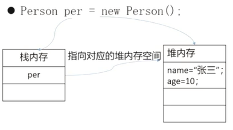  

```JAVA
类名 对象名称= new 类名(); //对象的声明与实例化

对象名称.属性名;  //访问属性
对象名称.方法名();//访问方法
```
```JAVA
Person per = null;  //声明
per = new Person(); //实例化操作
//================================
Person per = new Person();  //声明并实例化

per.name = "张三";
per.age = 10;
per.tell();
```

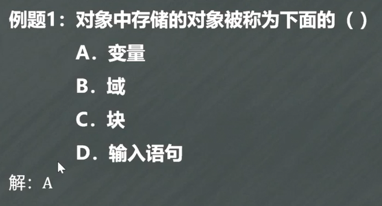  


> - 方法的重载
>   - 同一个类中存在方法名相同，但是参数的个数和数据类型不同的方法，通过**传递参数的不同和类型的不同**来完成不同的功能
>   - 与**返回类型无关**
>   - **方法签名= 方法名+ 形参列表**

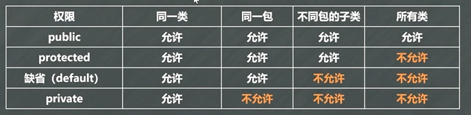  


```JAVA
访问修饰符 返回类型 方法名称(参数列表){
  方法体
}
```

```JAVA
public String say(int age,String name){
  return name;
}

public static void tell(int i, int j){
  System.out.println(i + j);
}

public static void tell(int i, int j, int n ){
  System.out.println(i + j + n);
}

```

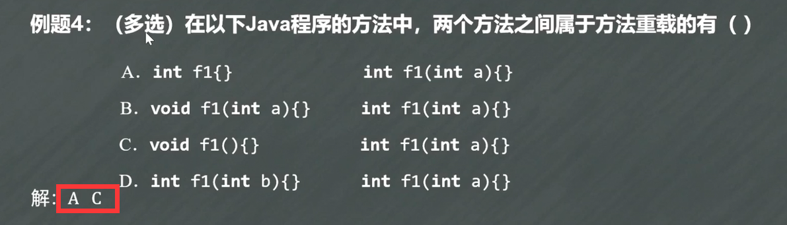  


## 2.3 封装、构造方法、`this`、`static`

> - 封装
>   - 将类的某些信息隐藏在类的内部，不允许外部程序直接访问，只能通过该类提供的方法来进行操作
>   - 步骤
>     - ① 修改属性可见行为`private`
>     - ② 创建`setter/getter`方法用于属性的读写
>     - ③ 在`setter`和`getter`中加入属性合法性控制语句
> - 包
>   - 管理`Java`文件，解决同名文件的冲突
>   - `package 包名`，如`package com.myclass`
>   - `import com.myclass`, `import com.myclass.*`
>   - `Java`中，**包的命名要求全小写**的字母
> - 构造方法
>   - `类名 对象名 = new 类名();  // 实际上就是调用的构造方法`
>   - 每一个类**都至少有**一个构造方法，普通java类都有默认的无参构造方法，但当自定义了有参构造方法后，默认的无参构造方法失效
>   - ① 构造方法名必须与类名一致
>   - ② 构造方法**不能有任何返回值类型的说明**
>   - ③ 普通java类都有默认的无参构造方法，但当自定义了有参构造方法后，默认的无参构造方法失效

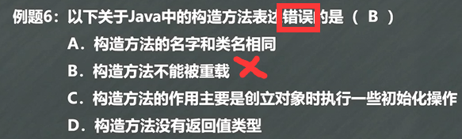  
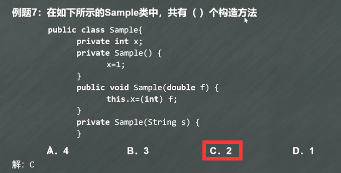  

> - `this`
>   - 类自身对象的引用 
>     - `this.属性`  `this.方法()`
>   - 调用本类中的构造方法
>     - `this();` **只能在构造函数中用** 
>       - **必须放在首行**
>   - 表示当前对象
> - `static`
>   - 声明全局属性
>   - 声明全局方法
>     - **直接通过类名调用**


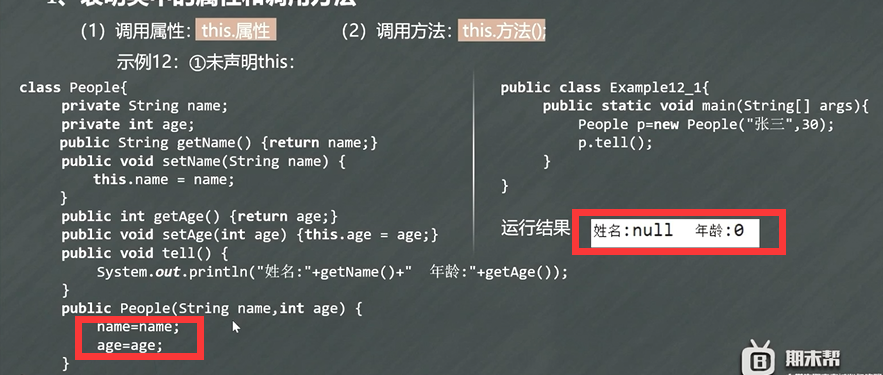  

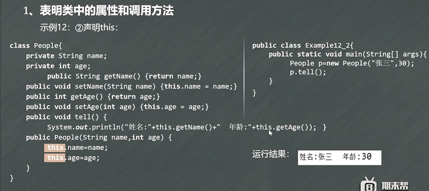  

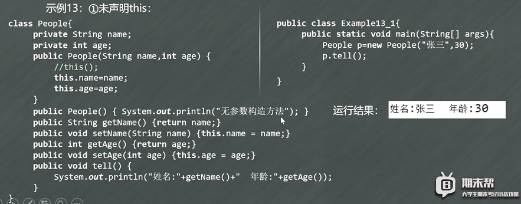  

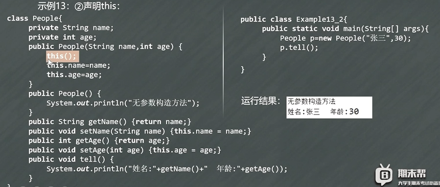  

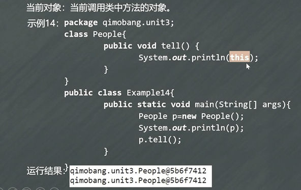  


## 2.4 继承、`super`、`final`

> - 继承
>   - 扩展类的已有功能：被继承的类称之为父类、**超类**，继承类被称为子类、**派生类**
>   - 限制
>     - `Java`只能**单继承，一个类最多继承一个父类**
>     - 子类不能直接访问父类的私有成员
>   -  子类对象**实例化前**，**必须先调用父类中的构造方法，之后调用子类构造方法**
>   - ① 扩展：在子类中添加新方法
>   - ② 重写：子类重写继承自父类的方法，要求：**方法签名和返回值**保持一致或者返回值是父类返回类型的子类型
>     - 并且被子类重写的方法**不能有比父类更严格的访问权限**
> - `super`
>   - 访问父类属性：`super.attribute`
>   - 访问父类方法：`super.method()`
>   - 子类中若没有显示调用父类的构造方法，则**默认调用父类的无参构造方法**
>   - 若要调用父类的构造方法，则**必须放在子类构造方法代码的第一行**
>   - 子类中若没有显示调用父类的构造方法且父类也没有无参的构造方法，代码容易出问题
> - `final`
>   - 完结器，意为“**最终**”
>   - 可以用来修饰类、方法、属性、变量
>     - ① 修饰类，该类**不可被继承**
>     - ② 修饰方法，该方法**不可被重写**
>     - ③ 修饰属性，该属性**必须在声明的同时被赋值，或在构造函数中被赋值**
>     - ④ 修饰变量：**常量**


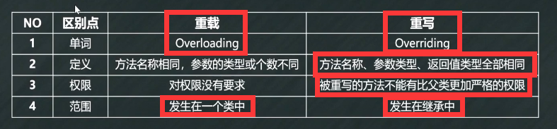  


```JAVA
class 子类 extends 父类{
  ......
}
```

```JAVA
class Person{
  private int age;
  private String name;
  public int getAge(){
    return age;
  }

  public void setAge(int age){
    this.age = age;
  }

  public void setName(String name){
    this.name = name;
  }

  public void tell(){
    System.out.println("姓名：" + getName() + "年龄" + getAge());
  }

}

class Student extends Person{
  private int score;
  public int getScore(){
    return score;
  }

  public void setScore(int score){
    this.score = score;
  }

  public void say(){
    System.out.println("成绩：" + getScore());
  }
}

public class Example{
  public static void main(String[] args){
    Student s = new Student();
    s.setAge(20);
    s.setName("hollow");
    s.setScore(100);
    s.tell();
    s.say();
  }
}


```

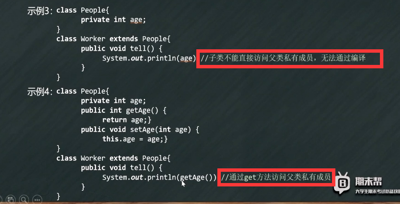  

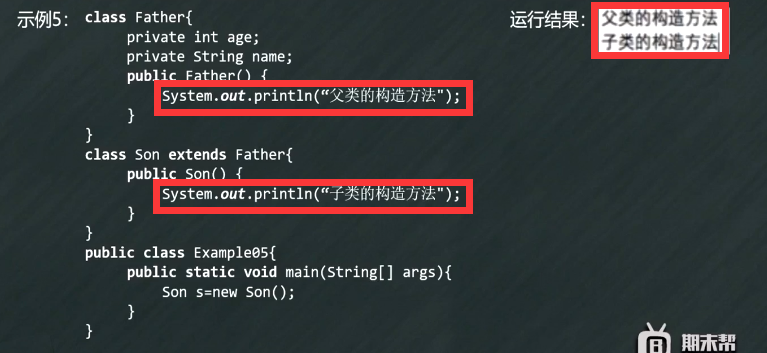  

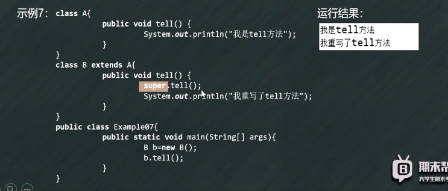  


## 2.5 抽象类、接口、多态
> - 抽象类
>   - 包含了抽象方法的类
>   - 无论是抽象类还是抽象方法，都是`abstract`关键字
>   - 抽象类**无法实例化，实例化需要通过子类**
>   - 抽象类**必须被继承**，**子类**（若不是抽象类）**必须重写抽象类中的所有抽象方法**
>   - 抽象方法直接分号结束，无方法体，`public abstract void tell()`
> - 接口
>   - 特殊的类，里全是**全局变量和公共的抽象方法**
>   - 一种用来约束类的规范，不关心类的内部数据和方法实现，而只规定类中必须提供的一些方法
>   - 一个子类可以**同时继承抽象类和实现接口**
> 多态性
>   - ①继承：在多态中必须存在有继承关系的子类和父类
>   - ②重写：子类对父类中某些方法进行重新定义，在调用这些方法时就会调用子类的方法
>   - ③向上转型：在多态中需要将子类的引用赋给父类对象，只有这样该引用才能够具备技能调用父类的方法
>   - 体现
>     - ① 方法的重载与重写
>     - ② 对象的多态性
> - `instanceof`
>   - 判断一个对象是不是一个类的实例
>   -  `a instanceof A`
>   - 子类 `instanceof` 父类 == `true`
>   - 父类 `instanceof` 子类 == `false`

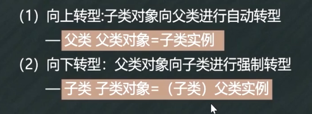  


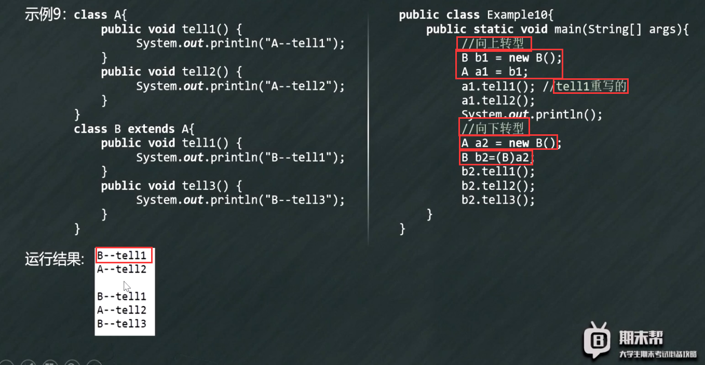  

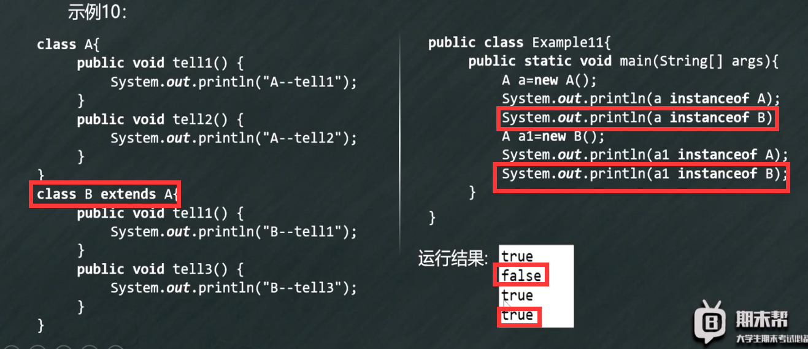  


```java
abstract class className{
  属性
  方法
  抽象方法
}

interface interName{
  全局变量
  抽象方法
}

class 类名 extends 抽象类名{}

class 类名 implements 接口名 extends 接口2{

}

```

```java
abstract class Abs{
  private int age;
   public int getAge(){
    return age;
  }

  public void setAge(int age){
    this.age = age;
  }

  public void tell(){
     System.out.println();
  }

  public abstract void say(); // 抽象
}


class AbsDemo extends Abs{
  public void say(){ //重写
    System.out.println(this.getAge());
  }
}
```
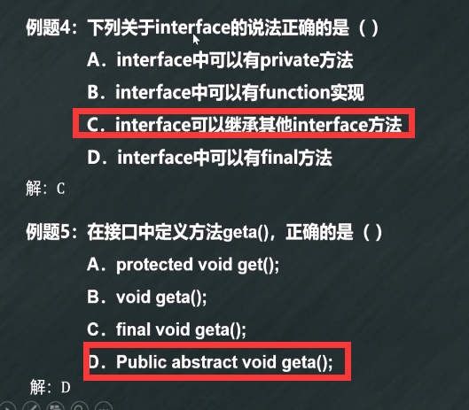  
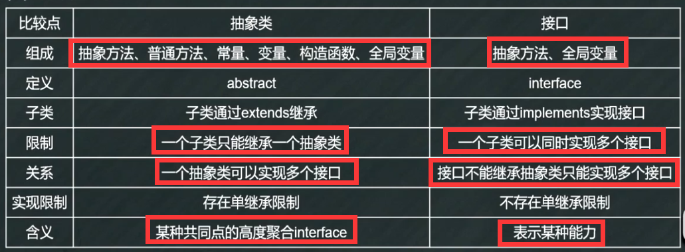  

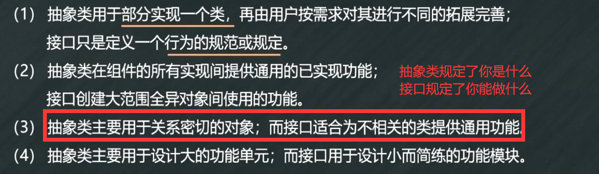  


## 2.6 String类、
> - String类
>   - 位于`java.lang`包
>   - **默认情况自动导入程序**
>   - 赋值
>     - 直接赋值：`String s = "hollow";`
>     - 通过构造函数赋值：`String s = new String("hollow");`
>   - 比较内容：`equals()`
>     - `==`在基本数据类型中比较的是数值，而**引用类型中比较的是地址**