# Scala语言概述

## 1. Scala语言概述

### 1.1 编程范式

- 命令式编程：`C++`、`Java`等面向对象程序编程语言
  
  - 完全根植于冯诺依曼体系结构
  
  - 涉及多线程之间的状态共享，需要**锁机制**
    
    - 保证数据一致性
    
    - 以实现并发控制
    
    - ——从而导致并发性降低

- 函数式编程（泛函编程）：`Haskell`、`Erlang`和`Lisp`等语言
  
  - 充分利用多核CPU的并发能力
    - 不会在多个线程之间共享状态，不需要用锁机制——可以更好并行处理，充分利用多核CPU并行处理

- 大数据时代也是多核CPU时代，因此函数式编程（泛函编程） 

### 1.2 Scala简介

- 类Java的多范式语言，它整合了**面向对象编程和函数式编程的最佳特性**
  
  - 是一门纯粹的面向对象的语言
  
  - 也是一门函数式语言

- 运行于Java虚拟机（JVM）之上兼容现有的Java程序
  
  - 因此Spark和Hadoop可以很好的融合

## 2. Scala基础语法

### 2.1 基本数据类型

- 和Java不同的是，在Scala中，这些类型都是<mark>类</mark>，并且都是包scala的成员
  
  - Int的全名是scala.Int
  
  - 而**java.lang.String**类来表示**字符串**

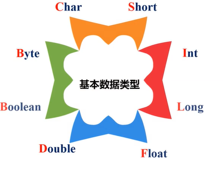

- 字面量（literal）

- 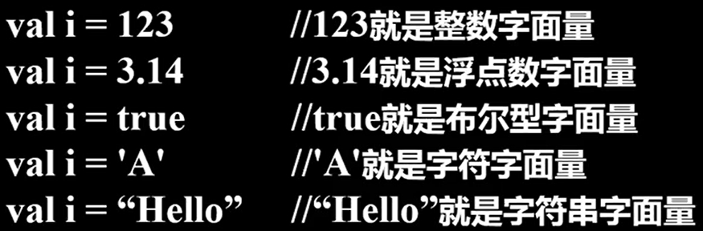

- 操作符
  
  - 
  
  - <mark>操作符在Scala中被定义成了方法</mark>
    
    - 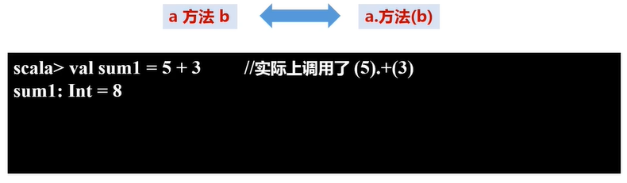
  
  - <mark>富包装类</mark>
    
    - 除了操作符，Scala还提供了许多常用运算的方法，只是这些方法不是在基本类里面定义，而是**被封装到一个对应的富包装类**中
    
    - 比如max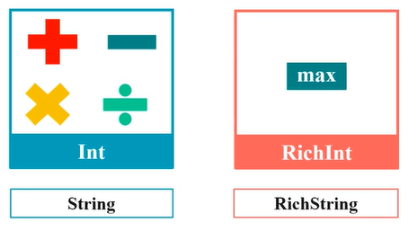

- 变量
  
  - 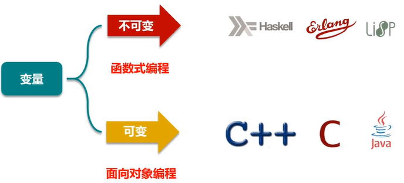
  
  - Scala有两种类型的变量
    
    - <mark>val：是不可变的，在声明时就必须被初始化</mark>，而且初始化以后就不能再赋值
    
    - <mark>var：是可变的</mark>，声明的时候需要进行初始化，初始化以后还可以再次对其赋值
  
  - 类型推断机制（typeinference）：根据初始值自动推断变量的类型

```scala
val  变量名:数据类型 = 初始值
var  变量名:数据类型 = 初始值
```

### 2.2 输入输出

- 控制台输入输出语句
  
  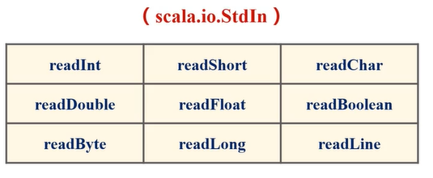
  
  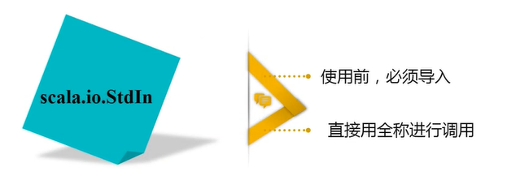

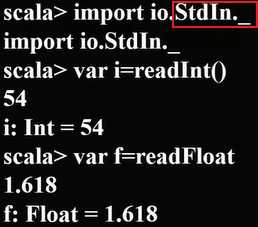

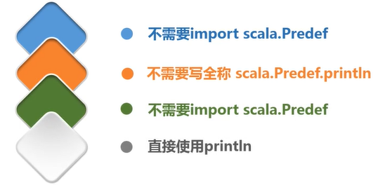

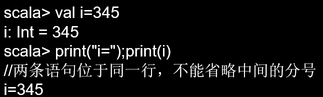

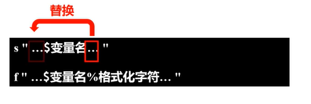

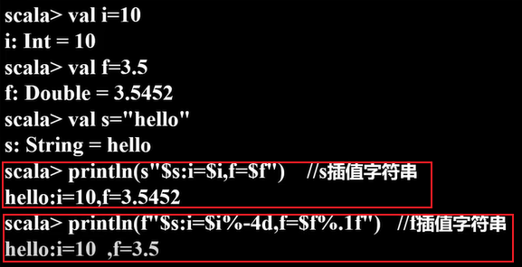

- 读写文件

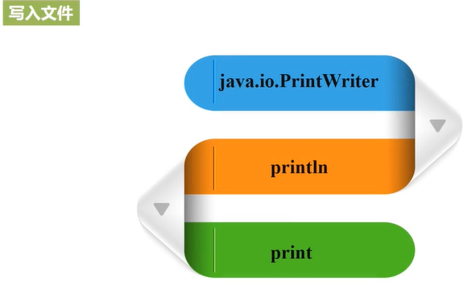

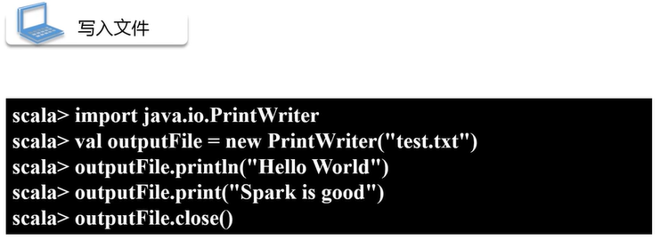

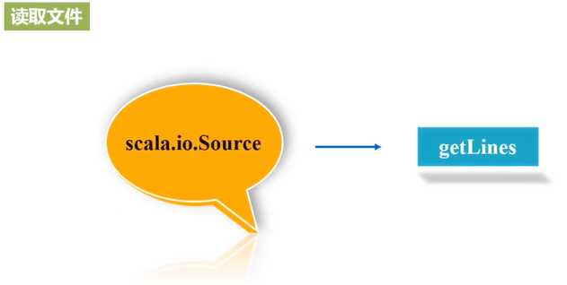

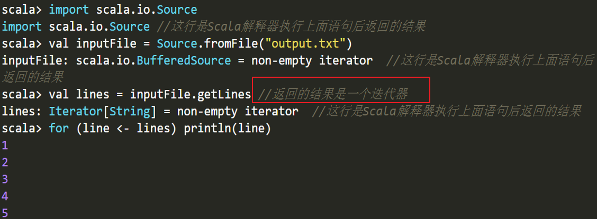

### 2.3 控制结构

1. `if`条件表达式

```scala
if (表达式) {
    语句块1
}
else {
    语句块2
}
```

2. `while`循环
   
   ```scala
   do{
           循环体
   }while (表达式)
   ```
   
   ```scala
   while (表达式){
           循环体
   }
   ```

3. `for`循环

```scala
for (变量 <- 表达式) {语句块}

for(i<-1 to 5;j<-1 to 10) println(i*j)
```

`“变量<-表达式”`被称为“<mark>生成器（generator）</mark>”

Scala也支持“**多个生成器**”的情形，可以用**分号**把它们隔开

```scala
for (变量 <- 表达式 if 条件表达式) 语句块

for(i<-1 to 5 if i%2 == 0) println(i)
```

<mark>“守卫(guard)”</mark>的表达式：过滤出一些满足条件的结果

```scala
for (变量 <- 表达式) yield {语句块}

val r=for (i <- Array(1,2,3,4,5) if i%2==0) yield { println(i); i}
//2
//4
//r: Array[Int] = Array(2,4)
```

<mark>for推导式</mark>：`for`结构可以在每次执行的时候创造一个值，然后将包含了所有产生值的**集合**作为`for`循环表达式的结果返回，集合的类型由生成器中的集合类型确定

4. 异常处理
   
   - <mark>受检异常</mark>：编写程序的时候清晰的知道可能会有哪些错误，并对每一个可能抛出的的错误给出处理方法
   
   - <mark>不受检异常</mark>：不是在编译程序的时候抛出，而是在运行期间抛出

`Scala`将<mark>所有异常当作不受检异常</mark>，仍使用`try-catch`结构来捕获异常

```scala
import java.io.FileReader 
import java.io.FileNotFoundException 
import java.io.IOException 
try { 
  val f = new FileReader("input.txt") // 文件操作 
} catch { 
  case ex: FileNotFoundException => // 文件不存在时的操作 
  case ex: IOException => // 发生I/O错误时的操作
} finally { 
  file.close() // 确保关闭文件 
} 
```

5. 循环控制
   
   Scala没有`break`和`continue`，其提供了一个`Breaks`类（位于包`scala.util.control`）
   
   - `breakable`：相当于`Java`中的`continue`
   
   - `break`：相当于`Java`中的`break`

```scala
import util.control.Breaks._ //导入Breaks类的所有方法
val array = Array(1,3,10,5,4)
breakable{
for(i<- array){
       if(i>5) break //跳出breakable，终止for循环，相当于Java中的break
       println(i)
    }
}
// 上面的for语句将输出1，3
```

```scala
for(i<- array){
    breakable{
        if(i>5) break  //跳出breakable，终止当次循环
                        //相当于Java的continue    
        println(i)    
    }
}// 上面的for语句将输出1，3，5，4
```

### 2.4  数据结构


## 3. 面向对象编程基础

### 3.1 类

### 3.2 对象

### 3.3 继承

### 3.4 特质

### 3.5 模式匹配

### 3.6 包


## 4. 函数式编程基础

### 4.1 函数定义与使用

### 4.2 高阶函数

### 4.3 针对容器的操作

### 4.4 函数式编程实例WordCount


