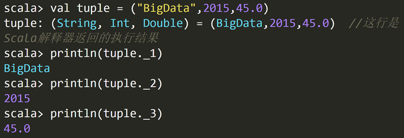

# Scala语言概述

## 1. Scala语言概述

### 1.1 编程范式

- 命令式编程：`C++`、`Java`等面向对象程序编程语言
  
  - 完全根植于冯诺依曼体系结构
  
  - 涉及多线程之间的状态共享，需要**锁机制**
    
    - 保证数据一致性
    
    - 以实现并发控制
    
    - ——从而导致并发性降低

- 函数式编程（泛函编程）：`Haskell`、`Erlang`和`Lisp`等语言
  
  - 充分利用多核CPU的并发能力
    - 不会在多个线程之间共享状态，不需要用锁机制——可以更好并行处理，充分利用多核CPU并行处理

- 大数据时代也是多核CPU时代，因此函数式编程（泛函编程） 

### 1.2 Scala简介

- 类Java的多范式语言，它整合了**面向对象编程和函数式编程的最佳特性**
  
  - 是一门纯粹的面向对象的语言
  
  - 也是一门函数式语言

- 运行于Java虚拟机（JVM）之上兼容现有的Java程序
  
  - 因此Spark和Hadoop可以很好的融合

## 2. Scala基础语法

### 2.1 基本数据类型

- 和Java不同的是，在Scala中，这些类型都是<mark>类</mark>，并且都是包scala的成员
  
  - Int的全名是scala.Int
  
  - 而**java.lang.String**类来表示**字符串**


- 字面量（literal）

- 

- 操作符
  
  - 
  
  - <mark>操作符在Scala中被定义成了方法</mark>
    
    - 
  
  - <mark>富包装类</mark>
    
    - 除了操作符，Scala还提供了许多常用运算的方法，只是这些方法不是在基本类里面定义，而是**被封装到一个对应的富包装类**中
    
    - 比如max

- 变量
  
  - 
  
  - Scala有两种类型的变量
    
    - <mark>val：是不可变的，在声明时就必须被初始化</mark>，而且初始化以后就不能再赋值
    
    - <mark>var：是可变的</mark>，声明的时候需要进行初始化，初始化以后还可以再次对其赋值
  
  - 类型推断机制（typeinference）：根据初始值自动推断变量的类型

```scala
val  变量名:数据类型 = 初始值
var  变量名:数据类型 = 初始值
```

### 2.2 输入输出

- 控制台输入输出语句
  
  
  
  


- 读写文件


### 2.3 控制结构

1. `if`条件表达式

```scala
if (表达式) {
    语句块1
}
else {
    语句块2
}
```

2. `while`循环
   
   ```scala
   do{
           循环体
   }while (表达式)
   ```
   
   ```scala
   while (表达式){
           循环体
   }
   ```

3. `for`循环

```scala
for (变量 <- 表达式) {语句块}

for(i<-1 to 5;j<-1 to 10) println(i*j)
```

`“变量<-表达式”`被称为“<mark>生成器（generator）</mark>”

Scala也支持“**多个生成器**”的情形，可以用**分号**把它们隔开

```scala
for (变量 <- 表达式 if 条件表达式) 语句块

for(i<-1 to 5 if i%2 == 0) println(i)
```

<mark>“守卫(guard)”</mark>的表达式：过滤出一些满足条件的结果

```scala
for (变量 <- 表达式) yield {语句块}

val r=for (i <- Array(1,2,3,4,5) if i%2==0) yield { println(i); i}
//2
//4
//r: Array[Int] = Array(2,4)
```

<mark>for推导式</mark>：`for`结构可以在每次执行的时候创造一个值，然后将包含了所有产生值的**集合**作为`for`循环表达式的结果返回，集合的类型由生成器中的集合类型确定

4. 异常处理
   
   - <mark>受检异常</mark>：编写程序的时候清晰的知道可能会有哪些错误，并对每一个可能抛出的的错误给出处理方法
   
   - <mark>不受检异常</mark>：不是在编译程序的时候抛出，而是在运行期间抛出

`Scala`将<mark>所有异常当作不受检异常</mark>，仍使用`try-catch`结构来捕获异常

```scala
import java.io.FileReader 
import java.io.FileNotFoundException 
import java.io.IOException 
try { 
  val f = new FileReader("input.txt") // 文件操作 
} catch { 
  case ex: FileNotFoundException => // 文件不存在时的操作 
  case ex: IOException => // 发生I/O错误时的操作
} finally { 
  file.close() // 确保关闭文件 
} 
```

5. 循环控制
   
   Scala没有`break`和`continue`，其提供了一个`Breaks`类（位于包`scala.util.control`）
   
   - `breakable`：相当于`Java`中的`continue`
   
   - `break`：相当于`Java`中的`break`

```scala
import util.control.Breaks._ //导入Breaks类的所有方法
val array = Array(1,3,10,5,4)
breakable{
for(i<- array){
       if(i>5) break //跳出breakable，终止for循环，相当于Java中的break
       println(i)
    }
}
// 上面的for语句将输出1，3
```

```scala
for(i<- array){
    breakable{
        if(i>5) break  //跳出breakable，终止当次循环
                        //相当于Java的continue    
        println(i)    
    }
}// 上面的for语句将输出1，3，5，4
```

### 2.4  数据结构

1. 数组（`Array`）
```SCALA
val intValueArr = Array(12,45,33)
val myStrArr = Array("BigData","Hadoop","Spark")

//多维数组的创建：调用Array的ofDim方法

//类型实际就是Array[Array[Int]]
val  myMatrix = Array.ofDim[Int](3,4) 
 //类型实际是Array[Array[Array[Int]]]
val  myCube = Array.ofDim[String](3,2,4) 

myMatrix(0)(1)//返回第一行第二列的元素
```
2. 元组（`Tuple`）
- 对多个不同类型对象的一种简单封装
- 使用下划线`_`加上从1开始的索引值，来访问元组的元素
- 如果需要在方法里返回多个不同类型的对象，`Scala`可以通过返回一个元组来实现
  

3. 容器（`Collection`）

  

- `Scala`用了三个包来组织容器类，分别是`scala.collection` 、`scala.collection.mutable`和`scala.collection.immutable`
- `scala.collection`封装了<mark>可变容器和不可变容器的超类或特质</mark>，定义了可变容器和不可变容器的一些**通用操作**
  - 所有容器的根为`Traverable`特质，表示可遍历的，它为所有的容器类定义了抽象的`foreach`方法，混入`Traverable`特质的容器类必须给出`foreach`方法的具体实现。
  - `Traverable`的下一级为`Iterable`特质，表示元素可一个个地依次迭代，该特质定义了一个抽象的`iterator`方法，混入该特质的容器必须实现`iterator`方法，返回一个迭代器（`Iterator`）
    - 序列`Seq`是按照从0开始的整数进行索引的
    - 映射`Map`是按照键值进行索引的
    - 而集合`Set`是没有索引的
4. 序列（`Sequence`）——列表（`List`）
- `::`在已有列表前端增加元素，向右结合
- <mark>不可变</mark>的对象序列。定义在`scala.collection.immutable`包中

```scala
val otherList="Apache"::strList
//执行该语句后strList保持不变，而otherList将成为一个新的列表：
//List("Apache","BigData","Hadoop","Spark")

```
- `Scala`还定义了一个空列表对象`Nil`，借助`Nil`，可以将多个元素用操作符`::`串起来初始化一个列表

```SCALA
val intList = 1::2::3::Nil
//等效
val intList = List(1,2,3)
```
- 除了`head`、`tail`操作是常数时间`O(1)`
  - 其它按索引访问的操作都需要从头开始遍历，是线性时间复杂度`O(N)`

5. 序列（`Sequence`）——向量（`Vector`）
- Vetor可以实现所有访问操作都是常数时间
- `+：` 和` :+` 是Seq的方法，执行后vector本身没变
  

6. 序列（Sequence）——Range

```scala
val r = new Range(1,5,1)
//创建一个从1到5的数值序列，包含区间终点5，步长为1
```
  
  
 1](../assets/b2552df7cdbcdcb1904d88bf611e57a255eb8d8687b0733336b2402bd066d4bb.png)  
>创建一个从1到5的数值序列，不包含区间终点5，步长为1
  
创建一个从1到10的数值序列，包含区间终点10，步长为2
  


>`1 to 10 by 2` 等效于`1.to(10).by(2)`，调用了`Range`的`by`方法
创建一个`Float`类型的数值序列，从`0.5f`到`5.9f`，步长为`0.3f`


1. 集合（`Set`）
- 不重复元素的容器
- 以“哈希”方法对元素的值进行组织——允许你快速地找到某个元素
  - 列表（`List`）中的元素是按照插入的先后顺序来组织的
- 集合包括可变集和不可变集，分别位于`scala.collection.mutable`包和`scala.collection.immutable`包
```SCALA
//缺省情况下创建的是不可变集
var mySet = Set("Hadoop","Spark")
mySet += "Scala" 

//如果要声明一个可变集，则需要提前引入scala.collection.mutable.Set
import scala.collection.mutable.Set
val myMutableSet = Set("Database","BigData")
myMutableSet += "Cloud Computing" 
```
8. 映射（`Map`）

- 默认情况下，`Scala`中使用不可变的映射。如果想使用可变映射，必须明确地导入`scala.collection.mutable.Map`
```scala
val university = Map("XMU" -> "Xiamen University", "THU" -> "Tsinghua University","PKU"->"Peking University")
//如果要获取映射中的值，可以通过键来获取
println(university("XMU"))

//如果给定的键不存在，则会抛出异常，为此，访问前可以先调用contains方法确定键是否存在
val xmu = if (university.contains("XMU")) university("XMU") else 0 println(xmu)


//可变的映射
import scala.collection.mutable.Map
val university2 = Map("XMU" -> "Xiamen University", "THU" -> "Tsinghua University","PKU"->"Peking University")
university2("XMU") = "Ximan University" //更新已有元素的值
university2("FZU") = "Fuzhou University" //添加新元素

//也可以使用+=操作来添加新的元素
university2 + = ("TJU"->"Tianjin University") //添加一个新元素
university2 + = ("SDU"->"Shandong University","WHU"->"Wuhan University") //同时添加两个新元素


```
9. 迭代器(`Iterator`)
- 不是一个容器，而是提供了按顺序访问容器元素的数据结构
- 迭代器包含两个基本操作：`next`和`hasNext`。
  - `next`可以返回迭代器的下一个元素，`hasNext`用于检测是否还有下一个元素


## 3. 面向对象编程基础

### 3.1 类
1. 类的定义
```SCALA
class Counter{
       //这里定义类的字段和方法
}
def 方法名(参数列表):返回结果类型={方法体}
class Counter {
  var value = 0
  def increment(step:Int):Unit = { value += step} //赋值表达式的值为Unit类型
  def current():Int = {value} //根据value的类型自动推断出返回类型为Int型

}

val myCounter = new Counter
myCounter.value = 5 //访问字段
myCounter. increment(3) //调用方法
println(myCounter.current) //调用无参数方法时，可以省略方法名后的括号

```
2. 类成员的可见性
- `Scala`也提供`private`和`protected`
  - `private`成员只对本类型和嵌套类型可见；
  - `protected`成员对本类型和其继承类型都可见
  - Scala采用类似Java中的getter和setter方法，定义了两个成对的方法`value`和`value_=`进行读取和修改
    - 编译器看到以`value`和`value_=`这种成对形式出现的方法时，它允许用户去掉下划线`_`，而采用类似赋值表达式的形式 
  

```SCALA
myCounter.value= 3 
// value和value_=成对形式出现时，等效于
myCounter.value_=(3)
```
3. 方法的定义方式
```SCALA
def 方法名(参数列表):返回结果类型={方法体}
```
- 方法参数前不能加上`val`或`var`，所有的方法参数都是不可变类型
- 无参数的方法定义时可以省略括号，这时调用时也不能带有括号；如果定义时带有括号，则调用时可以带括号，也可以不带括号
- 方法名后面的圆括号()可以用大括号{}来代替
- 如果方法只有一个参数，可以省略点号（.）而采用中缀操作符调用方法
  

4. 构造器
- `Scala`类的定义主体就是类的构造器，称为主构造器。在类名之后用圆括号列出主构造器的参数列表
- 主构造器的参数前可以使用`va`l或`var`关键字，`Scala`内部将自动为这些参数创建私有字段，并提供对应的访问方法
- 如果不希望将构造器参数成为类的字段，只需要省略关键字var或者val
  

- Scala类可以包含零个或多个辅助构造器，每个辅助构造器的第一个表达式必须是调用一个此前已经定义的辅助构造器或主构造器，调用的形式为“`this(参数列表)`”
```SCALA
class Counter {
    private var value = 0 
    private var name = ""
    private var step = 1 //计算器的默认递进步长
    println("the main constructor")
    def this(name: String){ //第一个辅助构造器
        this() //调用主构造器
        this.name = name
        printf("the first auxiliary constructor,name:%s\n",name)
    }
    def this (name: String,step: Int){ //第二个辅助构造器
        this(name) //调用前一个辅助构造器
        this.step = step
       printf("the second auxiliary constructor,name:%s,step:%d\n",name,step)
    }
    def increment(step: Int): Unit = { value += step}
    def current(): Int = {value}
}

```


### 3.2 对象
1. 单例对象
- Scala采用单例对象（singleton object）来实现与Java静态成员同样的功能
- 使用object 关键字定义<mark>单例对象</mark>
- 当一个单例对象和它的同名类一起出现时，这时的单例对象被称为这个同名类的<mark>“`伴生对象`”</mark>，相应的类被称为这个单例对象的<mark>“`伴生类`”</mark>
- 没有同名类的单例对象，被称为<mark>`孤立对象`</mark>。一般情况下，`Scala`程序的入口点`main`方法就是定义在一个孤立对象里
```SCALA
class Person(val name:String){
    private val id = Person.newPersonId() //调用了伴生对象中的方法
    def info() {
        printf("The id of %s is %d.\n",name,id)
    }
}
object Person {
    private var lastId = 0  //一个人的身份编号
    def newPersonId() = {
        lastId +=1
        lastId
    }
    def main(args: Array[String]) {
        val person1 = new Person("Lilei")
        val person2 = new Person("Hanmei")
        person1.info()     //调用了伴生类中的方法
        person2.info()
    }
}
//输出：
//The id of Lilei is 1.
//The id of Hanmei is 2.

```
2. `apply`方法
  
- `Scala`自动调用`Array类`的伴生对象`Array`中的一个称为`apply`的方法，来创建一个`Array对象` `myStrArr`
- `伴生对象`中的`apply`方法
  - 将所有类的构造方法以`apply`方法的形式定义在伴生对象中，这样伴生对象就像生成类实例的工厂，而这些`apply`方法也被称为**工厂方法**
- 为什么要设计apply方法？
  - **保持对象和函数之间使用的一致性**
    - 面向对象：“`对象.方法`” 
    - 数学：“`函数(参数)`”
    - `Scala`中一切都是对象，包括函数也是对象。`Scala`中的函数既保留括号调用样式，也可以使用点号调用形式，其对应的方法名即为`apply`


  

3. `update`方法
  

4. `unapply`方法
- 可以认为`unapply`方法是`apply`方法的反向操作，`apply`方法接受构造参数变成对象，而`unapply`方法接受一个对象，从中提取值


### 3.3 继承
- 只能重载`val`类型的字段，而不能重载`var`类型的字段。因为`var`类型本身就是可变的，所以，可以直接修改它的值，无需重载
- `Null`是所有引用类型的子类，其唯一的实例为`null`，表示一个“空”对象，可以赋值给任何引用类型的变量，但不能赋值给值类型的变量
- `Nothing`是所有其它类型的子类，包括`Null`。`Nothing`没有实例，主要用于异常处理函数的返回类型
  


### 3.4 特质
- `Scala`中没有接口的概念，而是提供了“特质(`trait`)”，它不仅实现了接口的功能，还具备了很多其他的特性
- 一个类只能继承自一个超类，却可以实现多个特质，从而重用特质中的方法和字段，实现了多重继承
- 特质既可以包含抽象成员，也可以包含非抽象成员。包含抽象成员时，不需要`abstract`关键字
- 特质可以使用`extends`继承其它的特质
- 可以使用`extends`或`with`关键字把特质混入类中
  - 如果要混入多个特质，可以连续使用多个`with`

```SCALA
trait Flyable {
       var maxFlyHeight:Int  //抽象字段
       def fly() //抽象方法
       def breathe(){ //具体的方法
             println("I can breathe")
       }
 }
trait HasLegs {
       val legs:Int   //抽象字段
       def move(){printf("I can walk with %d legs",legs)}
}
class Animal(val category:String){
       def info(){println("This is a "+category)}
}
class Bird(flyHeight:Int) extends Animal("Bird") with Flyable with HasLegs{
         var maxFlyHeight:Int = flyHeight //重载特质的抽象字段
         val legs=2 //重载特质的抽象字段
         def fly(){
               printf("I can fly at the height of %d",maxFlyHeight)
         }//重载特质的抽象方法
}

```


### 3.5 模式匹配
1. `match`语句

```SCALA
import scala.io.StdIn._
println("Please input the score:")
val grade=readChar()
grade match{
	case 'A' => println("85-100")
	case 'B' => println("70-84")
	case 'C' => println("60-69")
	case 'D' => println("<60")
	case _ => println("error input!")
}

```

2. `case类`
- case类自动重载了许多实用的方法，包括toString、equals和hashcode方法
- Scala为每一个case类自动生成一个伴生对象

```SCALA
//假设有如下定义的一个case类
case class Car(brand: String, price: Int)
//则，编译器自动生成的伴生对象是
object  Car{
            def apply(brand:String,price:Int)= new Car(brand,price)
            def unapply(c:Car):Option[(String,Int)]=Some((c.brand,c.price))
}

```
```SCALA
case class Car(brand: String, price: Int) 
val myBYDCar = Car("BYD", 89000)
val myBMWCar = Car("BMW", 1200000)
val myBenzCar = Car("Benz", 1500000)
for (car <- List(myBYDCar, myBMWCar, myBenzCar)) {
       car match{
              case Car("BYD", 89000) => println("Hello, BYD!")
              case Car("BMW", 1200000) => println("Hello, BMW!")
              case Car(brand, price) => println(“Brand:”+ brand +“, Price:”+price+“, do you want it?”)   
       }
 }

/*输出
Hello, BYD!
Hello, BMW!
Brand:Benz, Price:1500000, do you want it?
*/
```
## 4. 函数式编程基础

### 4.1 函数定义与使用
  

  

- 函数字面量可以体现函数式编程的核心理念
  - 函数是“头等公民”，可以像任何其他数据类型一样被传递和操作
    - 我们就可以**像定义变量那样去定义一个函数**
    - 就像变量的“**类型**”和“**值**”是分开的两个概念一样，函数式编程中，函数的“类型”和“值”也成为两个分开的概念，函数的“值”，就是“**函数字面量**”


  
  

- 当函数的每个参数在函数字面量内仅出现一次，可以省略`=>`并用下划线`_`作为参数的占位符来简化函数字面量的表示
- 第一个下划线代表第一个参数，第二个下划线代表第二个参数，以此类推


### 4.2 高阶函数
- 函数里面的参数还是函数
  
> 假设需要分别计算从一个整数到另一个整数的“连加和”、“平方和”以及“2的幂次和”

`不采用高阶函数.scala`
```scala
def powerOfTwo(x: Int): Int = {if(x == 0) 1 else 2 * powerOfTwo(x-1)}

def sumInts(a: Int, b: Int): Int = {
		if(a > b) 0 else a + sumInts(a + 1, b)
}
def sumSquares(a: Int, b: Int): Int = {
		if(a > b) 0 else a*a + sumSquares(a + 1, b)
}
def sumPowersOfTwo(a: Int, b: Int): Int = {
		if(a > b) 0 else powerOfTwo(a) + sumPowersOfTwo(a+1, b)
}

```
`采用高阶函数.scala`

```scala
def sum(f: Int => Int, a: Int, b: Int):Int = {
	if(a > b) 0 else f(a) + sum(f, a+1, b)
}

val a = sum(x=>x,1,5) //直接传入一个匿名函数
val b = sum(x=>x*x,1,5) //直接传入另一个匿名函数

val c = sum(powerOfTwo,1,5) //传入一个已经定义好的方法
```

### 4.3 针对容器的操作
1. 遍历操作

- `foreach`
```SCALA
val university = Map("XMU" ->"Xiamen University", "THU" ->"Tsinghua University","PKU"->"Peking University")

university foreach{kv => println(kv._1+":"+kv._2)}
//简化写法
university foreach{x=>x match {case (k,v) => println(k+":"+v)}}
//更加简化
university foreach{case (k,v) => println(k+":"+v)}

```

2. 映射操作

- `map`方法（**一对一**映射）
  - 返回一个与原容器类型大小都相同的新容器，只不过元素的类型可能不同
```SCALA
val books =List("Hadoop","Hive","HDFS")

//toUpperCase方法将一个字符串中的每个字母都变成大写字母
books.map(s => s.toUpperCase)
//res: List[String] = List(HADOOP, HIVE, HDFS)

books.map(s => s.length) //将字符串映射到它的长度
//res:List[Int] = List(6, 4, 4) ————————>新列表的元素类型为Int
```

- `flatMap`方法（**一对多**映射）
  - 对每个元素都会返回一个容器（而不是一个元素），把生成的多个容器“**拍扁**”成为一个容器并返回

```SCALA
books flatMap (s => s.toList)
//res: List[Char] = List(H, a, d, o, o, p, H, i, v, e, H, D, F, S)

```

3. 过滤操作

- `filter`方法
  - 接受一个返回布尔值的函数`f`作为参数，并将`f`作用到每个元素上，将`f`返回真值的元素组成一个新容器返回
```SCALA
val university = Map("XMU" ->"Xiamen University", "THU" ->"Tsinghua University","PKU"->"Peking University","XMUT"->"Xiamen University of Technology")

///过滤出值中包含“Xiamen”的元素，contains为String的方法
val xmus = university filter {kv => kv._2 contains "Xiamen"}
//scala.collection.immutable.Map[String,String] = Map(XMU -> Xiamen University, XMUT -> Xiamen University of Technology)

val l=List(1,2,3,4,5,6) filter {_%2==0}
//l:List[Int] = List(2, 4, 6)
```
4. 规约操作

- 规约操作是对容器元素进行两两运算，将其“规约”为一个值
- `reduce`方法
  - 接受一个二元函数`f`作为参数
    - 首先将`f`作用在某两个元素上并返回一个值
    - 然后再将`f`作用在**上一个返回值**和容器的下一个元素上，再返回一个值
    - 依此类推，最后容器中的所有值会被规约为一个值
- `reduceLeft`和`reduceRight`
  - 前者从左到右进行遍历，后者从右到左进行遍历

  

```SCALA
val list =List(1,2,3,4,5)

list map (_.toString) reduce ((x,y)=>s"f($x,$y)")
//String = f(f(f(f(1,2),3),4),5) 
//f表示传入reduce的二元函数
```


- `fold`方法
  - 比起`reduce`，提供了初始值
  - 一个双参数列表的函数，从提供的初始值开始规约
    - 第一个参数列表接受一个规约的初始值，第二个参数列表接受与reduce中一样的二元函数参数
- `foldLeft`和`foldRight`
  - 前者从左到右进行遍历，后者从右到左进行遍历

  


### 4.4 函数式编程实例WordCount

```SCALA
	import java.io.File
	import scala.io.Source
	import collection.mutable.Map

	object WordCount {
		def main(args: Array[String]) {

			val dirfile=new File("testfiles")
			val files  = dirfile.listFiles
			val results = Map.empty[String,Int]

			for(file <-files) {
				val data= Source.fromFile(file)

				val strs =data.getLines.flatMap{s =>s.split(" ")}

				strs foreach { word =>
					if (results.contains(word))
					results(word)+=1 else  results(word)=1
					}

				}

			results foreach{case (k,v) => println(s"$k:$v")}
		}
	}

```