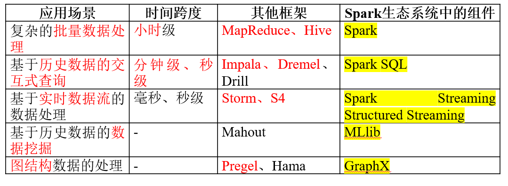
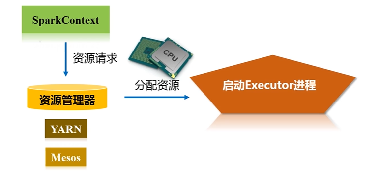

# Spark的设计与运行原理

## 1. Spark概述

- Apache软件基金会最重要的三大分布式计算系统开源项目
  - `Hadoop`
  - `Spark`
  - `Storm`
- 主要特点
  - 运行模式多样
  - 运行速度快
  - 容易使用
  - 通用性好
- `Hadoop`存在如下一些缺点
  - 表达能力有限
  - 磁盘`IO`开销大
  - 延迟高
    - 任务之间的衔接涉及IO开销
    - 在前一个任务执行完成之前，其他任务就无法开始，难以胜任复杂、多阶段的计算任务 
- `Spark`的优点
  - 计算模式也属于`MapReduce`，但**不局限于**`Map和Reduce`操作，还提供了多种数据集操作类型，编程模型比`Hadoop MapReduce`**更灵活**
  - 提供了**内存计算**，可将**中间结果**放到内存中，对于**迭代运算效率更高**
  - 基于`DAG`的任务调度执行机制，要优于`Hadoop MapReduce`的**迭代执行机制**
    - `RDD`：是`Resilient Distributed Dataset`（**弹性分布式数据集**）
      - **分布式内存**的一个**抽象概念**，提供了一种高度受限的**共享内存模型**
    - `DAG`：是`Directed Acyclic Graph`（**有向无环图**）的简称
      - 反映`RDD`之间的**依赖关系**
   - `Spark`用**1/10**的计算资源，获得了比`Hadoop`快**3**倍的速度

  

## 2. Spark生态
- 应用场景

  

## 3. Spark运行架构

- `RDD`：`Spark`**最核心的数据抽象**

### 3.1 基本概念
>  - `Executor`：是运行在工作节点（`WorkerNode`）的一个进程，负责运行`Task`
>  - 应用（`Application`）：用户编写的`Spark`应用程序
>  - 任务（ `Task` ）：运行在`Executor`上的工作单元 
>  - 作业（ `Job` ）：一个作业包含多个`RDD`及作用于相应`RDD`上的各种操作
>  - 阶段（ `Stage` ）：是作业的基本调度单位
>    - 一个作业会分为多组任务，每组任务被称为阶段
>    - 代表了一组**关联的、相互之间没有**`Shuffle`依赖关系的任务组成的**任务子集**

### 3.2 基本架构

  

  

  

  

  

### 3.3 基本运行流程（总结于3.4.5）

- 首先由`Driver`创建一个`SparkContext`，进行资源的申请、任务的分配和监控

  

- 资源管理器为`Executor`分配资源，并启动Executor进程

  

- `SparkContext`根据`RDD`的依赖关系构建`DAG`图
  - `DAG`图提交给`DAGScheduler`解析成`Stage`，然后把一个个`TaskSet`提交给底层调度器TaskScheduler处理
  - `Executor`向`SparkContext`申请`Task`，`Task Scheduler`将`Task`发放给`Executor`运行，并提供应用程序代码

  

- `Task`在`Executor`上运行，把执行结果反馈给`TaskScheduler`，然后反馈给`DAGScheduler`，运行完毕后写入数据并释放所有资源 

  

### 3.4 RDD原理

#### 3.4.1 RDD设计背景

- Hadoop无法很好处理
  - 迭代
  - 反复读写工作子集
- Hadoop开销
  - 磁盘IO
  - 序列化与反序列化
  

  

  

#### 3.4.2 RDD概念
> - 一个`RDD`就是一个分布式对象集合，本质上是一个**只读**的**分区**记录集合
>   - 分区是因为数据集太大单个内存放不下
>   - 只读：高度受限的共享内存模型，**不能直接修改**
>     - 基于稳定的物理存储中的数据集创建`RDD`
>     - 通过在其他`RDD`上执行确定的转换操作（如join和group by）而创建得到新的`RDD`
>   - 一个`RDD`的不同分区可以被保存到集群中不同的节点上
>     - 从而可以在集群中的不同节点上进行并行计算
> - `RDD`提供了一组丰富的操作以支持常见的数据运算，分为“动作”（`Action`）和“转换”（`Transformation`）两种类型
>   - 只有`Action`发生计算，`Transformation`记录转化生成`DAG`
>     - `惰性调用机制`
>   - **粗粒度**，相当于没有`SQL`中的`Where`语句，无脑all in
>     - 因此也不适用网页爬虫

  

  

> - 血缘关系`Lineage`——`DAG`**拓扑排序**的结果
>   - 可以**恢复数据**（寻亲）
>       - 无需回滚
>       - 重算过程在不同节点之间并行
>   - **流水线优化**（不需要保存中间结果）
>       - 避免了不必要的IO磁盘开销
>       - 存放的数据可以是`Java`对象，避免了**不必要的对象序列化和反序列化**

#### 3.4.3 RDD依赖关系

> - 是划分不同阶段的依据

  

> - 只要发生了shuffle的地方就是宽依赖

  

> - 窄依赖

  

> - 宽依赖

  

  

#### 3.4.4 RDD阶段划分

- 窄依赖就断开，宽依赖就不断
- 窄依赖对于作业的流水线优化很有利，宽依赖无法优化
  - 逻辑上，每个RDD 操作都是一个`fork/join`（一种用于并行执行任务的框架），把计算`fork` 到每个`RDD` 分区，完成计算后对各个分区得到的结果进行`join` 操作，然后`fork/join`下一个`RDD` 操作

  

  

  

- 流水线优化
  - 不发生无意义的等待
    - 只要发生shuffle就一定会写磁盘
  - 具体方法
    - 在`DAG`中进行**反向解析**，**遇到宽依赖就断开**
    - 遇到窄依赖就把当前的`RDD`加入到`Stage`中
    - 将窄依赖尽量划分在同一个`Stage`中，可以实现流水线计算

  

> - 被分成三个`Stage`，在`Stage2`中，从`map`到`union`都是窄依赖，这两步操作可以形成一个流水线操作

  

#### 3.4.5 RDD运行过程
> 1. 创建`RDD`对象；
> 2. `SparkContext`负责计算`RDD`之间的依赖关系，构建`DAG`；
> 3. `DAGScheduler`负责把`DAG`图分解成多个`Stage`，每个`Stage`中包含了多个`Task`，每个`Task`会被`TaskScheduler`分发给各个`WorkerNode`上的`Executor`去执行

  

## 4. Spark部署与应用方式

- `Standalone`，自带
- `Spark on Mesos`，和`Spark`有血缘关系，更好支持`Mesos`
- `Spark on YARN`，`Hadoop`集群
