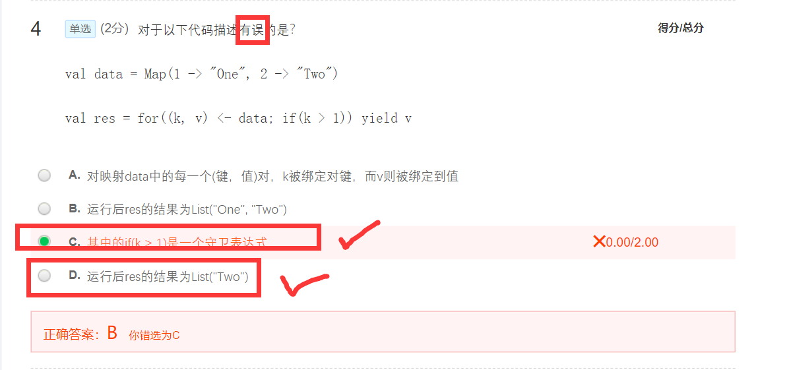

# Chap 1
> - 大数据带来思维方式的三个转变是
>   - 相关而非因果
>   - 全样而非抽样
>   - 效率而非精确
> - 大数据发展的三个阶段
>   - 萌芽期
>   - 成熟期
>   - 大规模应用期
> - 数据产生方式大致经历了三个阶段
>   - 运营式系统阶段
>   - 感知式系统阶段
>   - 用户原创内容阶段

  

  

  

  


> - 批处理框架
>   - `Hive`
>   - `MapReduce`
> - 基于历史数据的交互式查询
>   - `Impala`
>   - `Dremel`
>   - `Spark SQL`
> - 实时数据处理
>   - `S4`
>   - `Storm`
>   - `Spark Streaming`
> - 图结构
>   - `Pregel`
>   - `GraphX`

  
  

  

  

  


# Chap 2
  

  

  

  

  
  

  

  

  

  

  


> - **命令式**编程：`C++`、`Java`等面向对象程序编程语言
>   - 完全根植于冯诺依曼体系结构
>   - 涉及多线程之间的状态共享，需要**锁机制**
> - **函数式**编程（泛函编程）：`Haskell`、`Erlang`和`Lisp`等语言
>   - 充分利用多核CPU的并发能力
>     - 不会在多个线程之间共享状态，不需要用锁机制
> - 大数据时代也是多核CPU时代，因此函数式编程（泛函编程） 
> - `Scala`
>   - 类`Java`的多范式语言，它整合了面向对象编程和函数式编程的最佳特性
>   - 运行于`Java`虚拟机（`JVM`）之上兼容现有的`Java`程序

```SCALA
for (变量 <- 表达式) {语句块}

for(i<-1 to 5;j<-1 to 10) println(i*j)
```

```SCALA
for (变量 <- 表达式) yield {语句块}

val r=for (i <- Array(1,2,3,4,5) if i%2==0) yield { println(i); i}
//2
//4
//r: Array[Int] = Array(2,4)
```

```
import java.io.FileReader 
import java.io.FileNotFoundException 
import java.io.IOException 
try { 
  val f = new FileReader("input.txt") // 文件操作 
} catch { 
  case ex: FileNotFoundException => // 文件不存在时的操作 
  case ex: IOException => // 发生I/O错误时的操作
} finally { 
  file.close() // 确保关闭文件 
} 
```
```SCALA
import util.control.Breaks._ //导入Breaks类的所有方法
val array = Array(1,3,10,5,4)
breakable{
for(i<- array){
       if(i>5) break //跳出breakable，终止for循环，相当于Java中的break
       println(i)
    }
}
// 上面的for语句将输出1，3
```
```SCALA
for(i<- array){
    breakable{
        if(i>5) break  //跳出breakable，终止当次循环
                        //相当于Java的continue    
        println(i)    
    }
}// 上面的for语句将输出1，3，5，4
```
```SCALA
val otherList="Apache"::strList
//执行该语句后strList保持不变，而otherList将成为一个新的列表：
//List("Apache","BigData","Hadoop","Spark")

```
  
```SCALA
//缺省情况下创建的是不可变集
var mySet = Set("Hadoop","Spark")
mySet += "Scala" 

//如果要声明一个可变集，则需要提前引入scala.collection.mutable.Set
import scala.collection.mutable.Set
val myMutableSet = Set("Database","BigData")
myMutableSet += "Cloud Computing" 
```
```SCALA
val university = Map("XMU" -> "Xiamen University", "THU" -> "Tsinghua University","PKU"->"Peking University")
//如果要获取映射中的值，可以通过键来获取
println(university("XMU"))

//如果给定的键不存在，则会抛出异常，为此，访问前可以先调用contains方法确定键是否存在
val xmu = if (university.contains("XMU")) university("XMU") else 0 println(xmu)


//可变的映射
import scala.collection.mutable.Map
val university2 = Map("XMU" -> "Xiamen University", "THU" -> "Tsinghua University","PKU"->"Peking University")
university2("XMU") = "Ximan University" //更新已有元素的值
university2("FZU") = "Fuzhou University" //添加新元素

//也可以使用+=操作来添加新的元素
university2 + = ("TJU"->"Tianjin University") //添加一个新元素
university2 + = ("SDU"->"Shandong University","WHU"->"Wuhan University") //同时添加两个新元素


```

> 类成员的可见性
> 
> - `Scala`也提供`private`和`protected`
>   - `private`成员只对本类型和嵌套类型可见；
>   - `protected`成员对本类型和其继承类型都可见
>   - Scala采用类似Java中的getter和setter方法，定义了两个成对的方法`value`和`value_=`进行读取和修改
>     - 编译器看到以`value`和`value_=`这种成对形式出现的方法时，它允许用户去掉下划线`_`，而采用类似赋值表达式的形式 
  

> 单例对象
> - Scala采用单例对象（singleton object）来实现与Java静态成员同样的功能
> - 使用object 关键字定义<mark>单例对象</mark>
> - 当一个单例对象和它的同名类一起出现时，这时的单例对象被称为这个同名类的<mark>“`伴生对象`”</mark>，相应的类被称为这个单例对象的<mark>“`伴生类`”</mark>
> - 没有同名类的单例对象，被称为<mark>`孤立对象`</mark>。一般情况下，`Scala`程序的入口点`main`方法就是定义在一个孤立对象里
```SCALA
class Person(val name:String){
    private val id = Person.newPersonId() //调用了伴生对象中的方法
    def info() {
        printf("The id of %s is %d.\n",name,id)
    }
}
object Person {
    private var lastId = 0  //一个人的身份编号
    def newPersonId() = {
        lastId +=1
        lastId
    }
    def main(args: Array[String]) {
        val person1 = new Person("Lilei")
        val person2 = new Person("Hanmei")
        person1.info()     //调用了伴生类中的方法
        person2.info()
    }
}
//输出：
//The id of Lilei is 1.
//The id of Hanmei is 2.

```
> `apply`方法
> - `伴生对象`中的`apply`方法
>   - 将所有类的构造方法以`apply`方法的形式定义在伴生对象中，这样伴生对象就像生成类实例的工厂，而这些`apply`方法也被称为**工厂方法**
> - 为什么要设计apply方法？
>   - **保持对象和函数之间使用的一致性**
>     - 面向对象：“`对象.方法`” 
>     - 数学：“`函数(参数)`”
>     - `Scala`中一切都是对象，包括函数也是对象。`Scala`中的函数既保留括号调用样式，也可以使用点号调用形式，其对应的方法名即为`apply`

```SCALA
trait Flyable {
       var maxFlyHeight:Int  //抽象字段
       def fly() //抽象方法
       def breathe(){ //具体的方法
             println("I can breathe")
       }
 }
trait HasLegs {
       val legs:Int   //抽象字段
       def move(){printf("I can walk with %d legs",legs)}
}
class Animal(val category:String){
       def info(){println("This is a "+category)}
}
class Bird(flyHeight:Int) extends Animal("Bird") with Flyable with HasLegs{
         var maxFlyHeight:Int = flyHeight //重载特质的抽象字段
         val legs=2 //重载特质的抽象字段
         def fly(){
               printf("I can fly at the height of %d",maxFlyHeight)
         }//重载特质的抽象方法
}

```
```SCALA
case class Car(brand: String, price: Int) 
val myBYDCar = Car("BYD", 89000)
val myBMWCar = Car("BMW", 1200000)
val myBenzCar = Car("Benz", 1500000)
for (car <- List(myBYDCar, myBMWCar, myBenzCar)) {
       car match{
              case Car("BYD", 89000) => println("Hello, BYD!")
              case Car("BMW", 1200000) => println("Hello, BMW!")
              case Car(brand, price) => println(“Brand:”+ brand +“, Price:”+price+“, do you want it?”)   
       }
 }

/*输出
Hello, BYD!
Hello, BMW!
Brand:Benz, Price:1500000, do you want it?
*/
```
```SCALA
def sum(f: Int => Int, a: Int, b: Int):Int = {
	if(a > b) 0 else f(a) + sum(f, a+1, b)
}

val a = sum(x=>x,1,5) //直接传入一个匿名函数
val b = sum(x=>x*x,1,5) //直接传入另一个匿名函数

val c = sum(powerOfTwo,1,5) //传入一个已经定义好的方法
```
```SCALA
val university = Map("XMU" ->"Xiamen University", "THU" ->"Tsinghua University","PKU"->"Peking University")

university foreach{kv => println(kv._1+":"+kv._2)}
//简化写法
university foreach{x=>x match {case (k,v) => println(k+":"+v)}}
//更加简化
university foreach{case (k,v) => println(k+":"+v)}

```
> - `fold`方法
>   - 比起`reduce`，提供了初始值
>   - 一个双参数列表的函数，从提供的初始值开始规约
>     - 第一个参数列表接受一个规约的初始值，第二个参数列表接受与reduce中一样的二元函数参数
> - `foldLeft`和`foldRight`
>   - 前者从左到右进行遍历，后者从右到左进行遍历
> - `WordCount`
>   - `.flatMap(_.split(" "))`
>   - `.map(x=>(x,1))`
>   - `.reduceByKey(_+_)`


  

  

  

  

  

  

  

  

  

  

  

  

  


# CHAP 3
