# 1. 操作系统的概念

> - 一组`......`的程序的集合
>   - 控制与管理计算机软硬件资源
>   - 合理地调度各类作业
> -    方便用户使用计算机

# 2. 操作系统的功能
> - 资源管理者（**大管家**）：`OS`的任务是有效地**管理计算机系统的各部分**
>   - **处理机管理**
>     - 进程控制
>       - 为作业创建进程
>       - 撤消已结束的进程
>       - 控制进程在运行过程中的状态转换
>     - 进程同步
>       - 为多个进程(含线程)的运行进行协调
>     - 进程通信
>       - 实现在相互合作的进程之间的信息交换
>     - 调度
>       - 作业调度：
>       - 进程调度
>       - **对比**：作业调度是外存与内存之间的调度，发生频率很低，使进程**从创建态到就绪态**的过程；而进程调度是从内存到`cpu`的调度，发生频率很高，使进程**从就绪态到运行态**的过程
>   - **内存管理**
>     - 内存分配和内存回收
>     - 内存保护
>       - 确保每道用户程序都只在自己的内存空间内运行，彼此互不干扰
>     - 地址映射
>       - 将地址空间中的**逻辑地址**转换为内存空间中与之对应的**物理地址**
>     - 内存扩充
>       - 从逻辑上去扩充内存容量，使用户所感觉到的内存容量比实际内存容量大得多
>   - **文件管理**
>     - 文件存储空间的管理
>       - 为每个文件分配必要的外存空间，提高外存的利用率，并能有助于提高文件系统的运行速度
>     - 目录管理
>       - 为每个文件建立其目录项，并对众多的目录项加以有效的组织，以实现方便的按名存取
>     - 文件的读/写管理
>     - 文件保护
> 
>   - **设备管理**
>     - 缓冲管理
>       - 有效地缓和`CPU`和`I/O`设备速度不匹配的矛盾，提高`CPU`的利用率
>     - 设备分配
>     - 设备处理
>      - 用于实现CPU和设备控制器之间的通信
> 
> - 扩展机器（**让计算机变得更美**）:为用户提供比实际机器更便于运用的**抽象**，包括进程、地址空间、文件等，提供**接口**（**用户和计算机硬件之间的接口**）
>   - **用户接口**
>     - 图形用户接口:`GUI`
>     - 命令接口：联机命令接口
>     - 程序接口：一组**系统调用**

# 3. OS 特征

> - 如果失去并发性，则系统中只有一个程序正在运行，则共享性失去存在的意义
> - 如果失去共享性，QQ和微信也就不能同时访问硬盘资源，也就无法文件“同时” 发送，也就无法并发
> - 因此**互为存在条件**

  

## 3.1 并发（1/2）

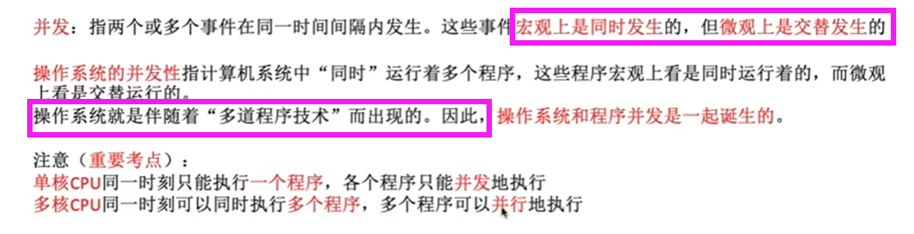  

## 3.2 共享（2/2）

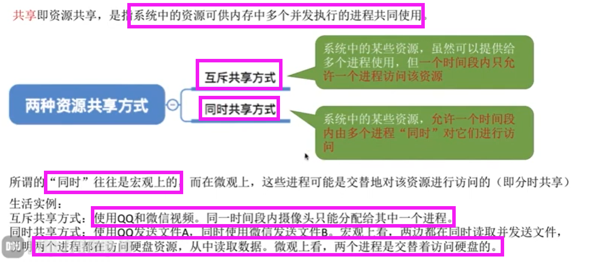  

## 3.3 虚拟
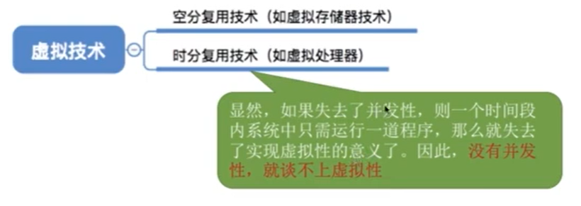  

## 3.4 并发

> 在多道程序环境下，允许多个程序并发执行，但由于**资源有限**，进程的执行不是一贯到底，而是走走停停，以不可预知的速度向前推进，这就是进程的异步性
> - **并发程序会争抢**系统资源

# 4. OS 发展史
## 4.1 真空管和穿孔卡片
   1. 无`OS`
   2. 纯机器语言

## 4.2 晶体管和批处理系统

> - 单道批处理——`OS`雏形
> - 多道批处理——`OS`诞生
>  - 但是**没有人机交互——因此诞生分时操作系统**

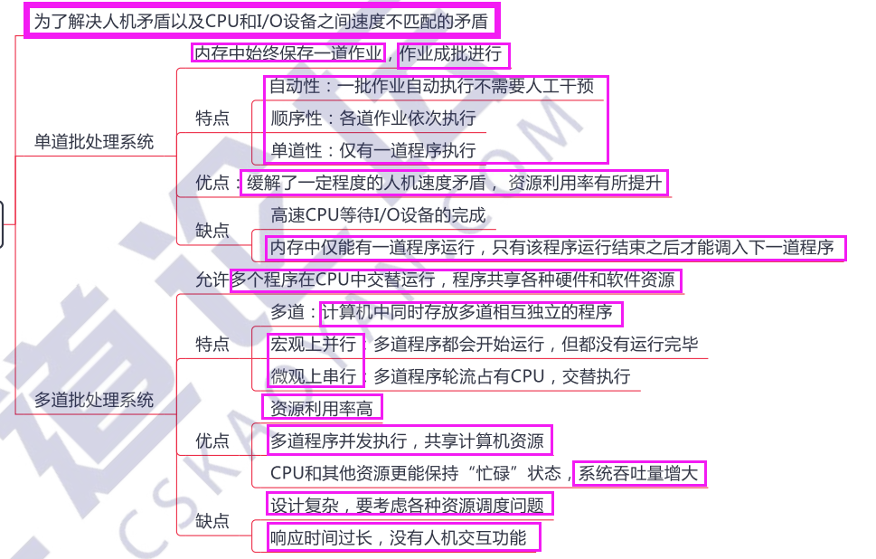  

## 4.3 分时操作系统与实时操作系统

> - 分时：对用户平等，但是无法优先处理紧急任务
> - 实时：能够**优先响应紧急任务**，并且在**严格的时限内完成**任务
>     - 硬实时：  必须严格`e.g.`导弹
>     - 软实时：偶尔违反`e.g.`订票系统

  

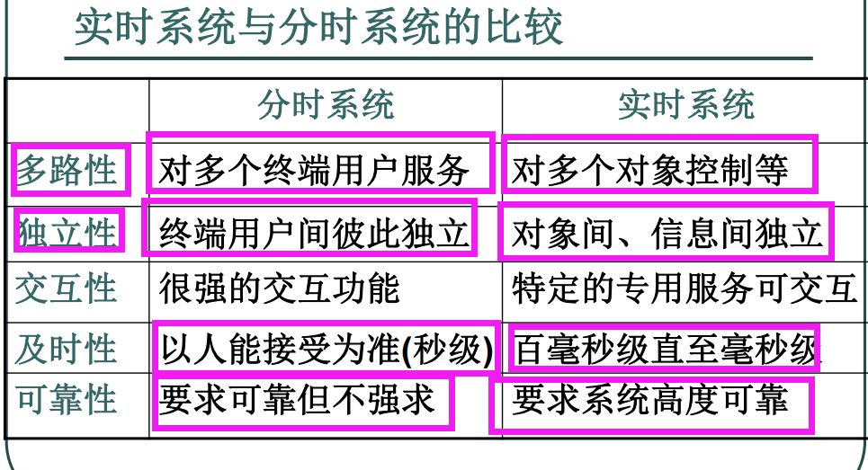  

## 4.4 分布式操作系统与网络操作系统

- 网络操作系统
  - 高效可靠的网络通信能力，网络的连接
    - `C/S`、`P2P`
    - 局域网连接、广域网连接
  - 多种网络的服务
    - 电子邮件
    - 文件传输
    - 文件传输
    - 共享打印
- 分布式操作系统
  - 各处理单元高度自治
  - 各处理单元要相互协调
  - **并行**地运行**分布式程序**

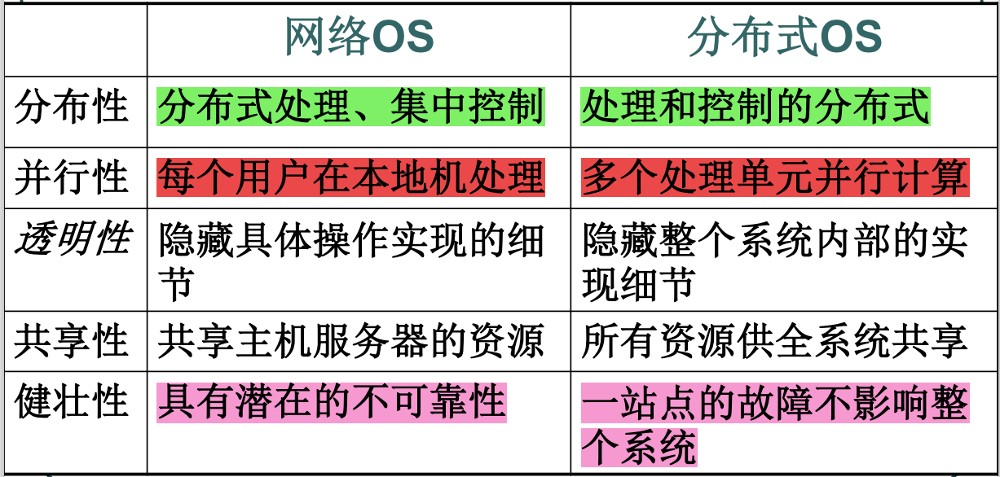  

# 5. 操作系统的运行模式

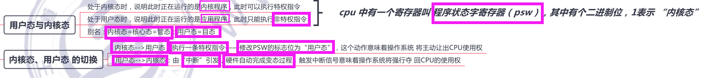  

# 6. 中断

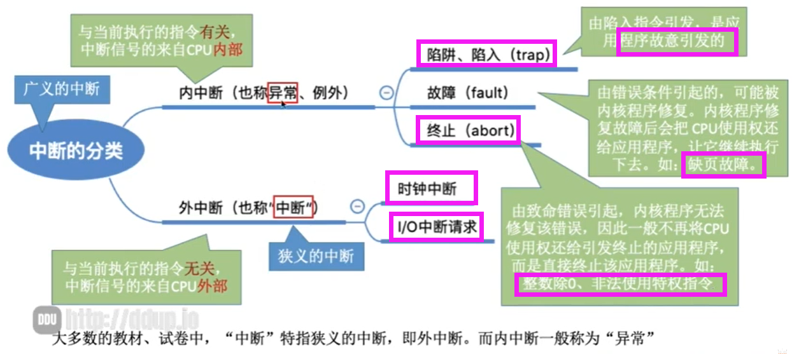  

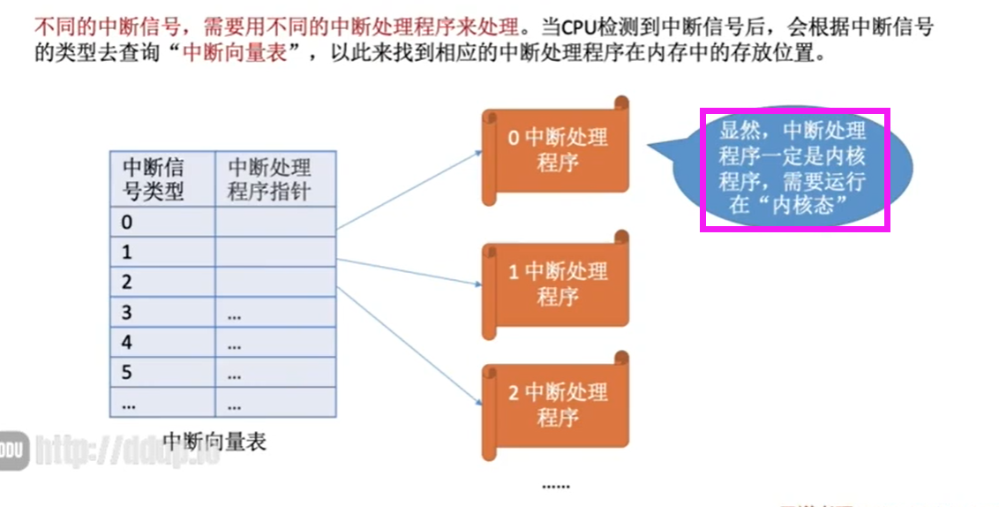  

# 7. 系统调用的过程和应用

## 7.1 应用
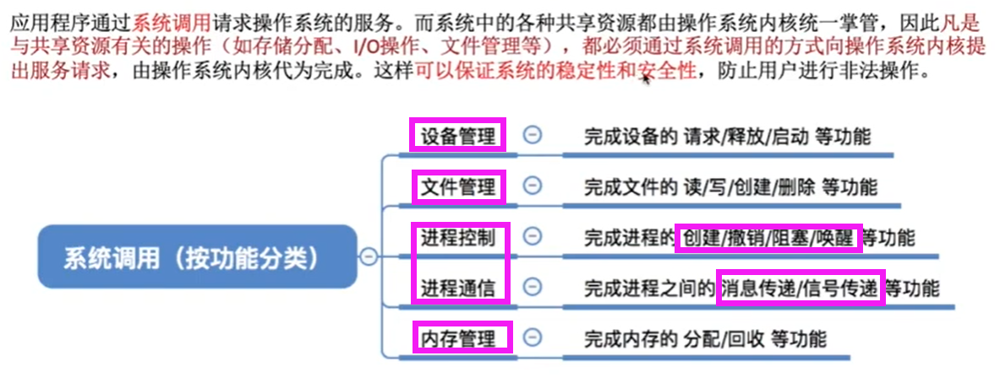  

## 7.2 过程

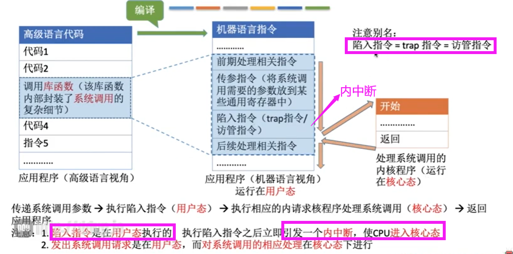  

# 8. 体系结构

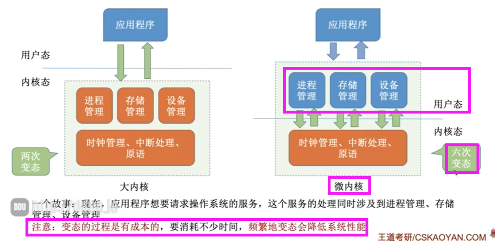  

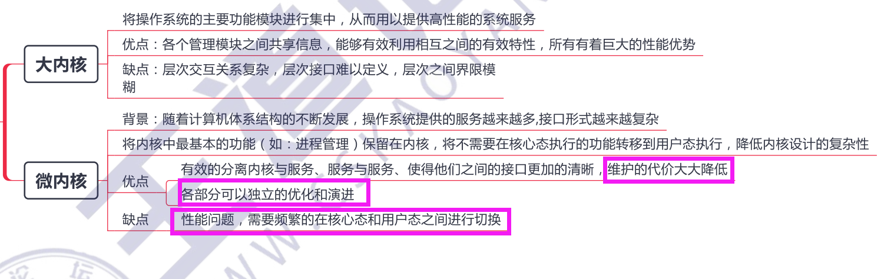  

# 习题
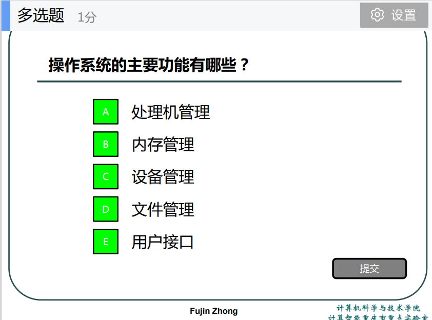  
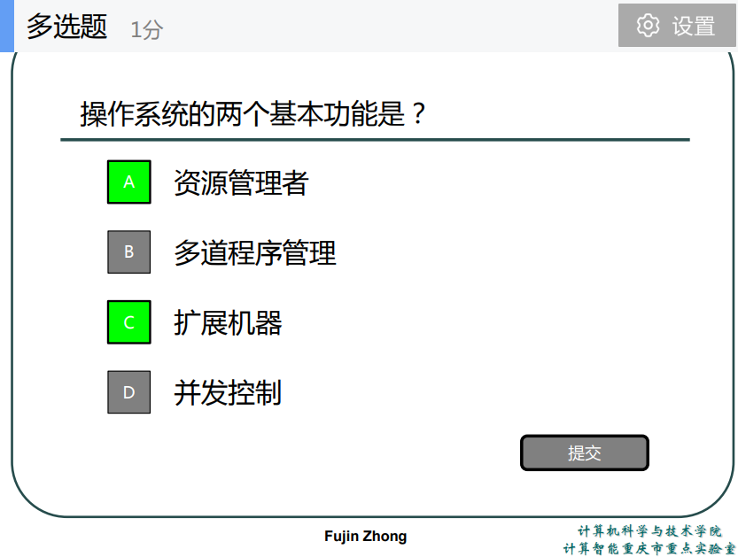  
