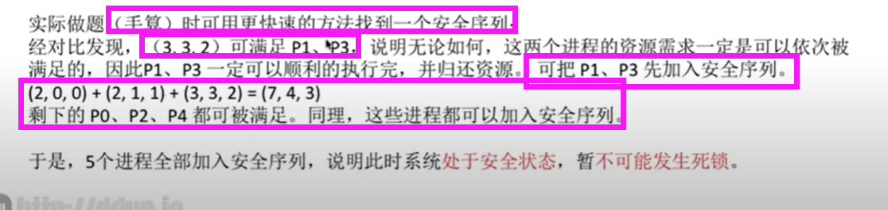

# 1. 进程的基本概念

## 1.1 进程的定义（不同角度）

> - 程序作用在一组数据上的一次执行过程（一次计算）
> - 操作系统中一个可独立调度和资源分配的基本单位
> - 可以与其他程序并发执行的程序的一次执行

## 1.2 进程的特征、与程序的区别
> - 动态性
>   - 进程由创建到消亡是有一定生命期的，在生命期间进程是一个活动实体
>   - 而程序是可以永久存放于某种介质上的有序指令集合，是一个静态实体
> - 并发性
>   - 在内存中的多个进程能在一段时间内同时运行
>   - 多个进程的程序可以并发执行,而程序是不能并发执行的
> - 独立性
>   - 进程是一个能够独立运行的基本单位，即只有进程才能被独立调度运行及独立获得资源
>   - 程序是不能作为调度运行和获得资源的基本单位的
> - 异步性
>   - 进程以各自独立的、不可预知的速度向前推进
> - 结构特征
>   - 进程控制块(`PCB`)、程序段、数据段

## 1.3 进程（实体）的组成

> 进程实体是进程的一次快照，进程是一次过程

> - 进程控制块`PCB`
>   - **进程存在的唯一标识**
> - 程序段
> - 数据段

  

  

## 1.4 进程状态
> - 不能由阻塞态直接转化为运行态
> - 不能由就绪态直接转为阻塞态

  
  

# 2. 进程控制与原语
> - 用原语来实现进程控制，具有**原子性**，一气呵成(即操作时要**屏蔽中断**)
> - 如果不具有原子性，可能会导致某些关键数据结构信息不一致
> - 作业：在外存还没运行的程序

  
  
## 2.1 创建原语
  

## 2.2 撤销原语
  

## 2.3 阻塞原语和唤醒原语

  

## 2.3 切换原语
  

# 3. 进程同步与互斥
> - 进程同步————**解决异步**的问题，就是一种**制约关系**
> - **协调**进程之间的**相互制约关系**，达到**资源共享和进程协作**，**避免**进程之间的**冲突**
> - 临界资源：一段时间内只允许一个进程使用
> - 进入区、临界区、退出区、剩余区

  

  

## 3.1 进程互斥原则

1. 空闲让进：临界区空闲时，允许一个请求进入临界区的进程立即进入临界区
2. 忙则等待：临界区已有进程时，其余进程进入临界区必须等待
3. 有限等待：保证**不会饥饿**，要在**有限时间**内进入
4. 让权等待：若进程不能进入临界区，应立即释放处理机，**防止忙等待**

## 3.2 信号量机制

> 整形信号量不满足让权等待，因此人们提出记录型信号量

  

  

## 3.3 利用信号量实现同步
> - P(S)——申请一个资源`mutex`，资源不够就阻塞等待
> - V(S)——释放一个资源`mutex`，若有进程在等待，唤醒一个进程
> - 不同的临界资源需要设置不同的互斥信号量`mutex`，初始值大于等于`1`
> - 在进入区P(`mutex`)——申请资源
> - 在退出区V(`mutex`)——释放资源

## 3.4 利用信号量实现同步
> 1. 分析在什么地方需要保证“**一前一后**”
> 2. 设置同步信号量`S`，初始值`0`
> 3. **前V后P**：在前操作之后执行`V(S)`，在后操作之前执行`P(S)`

  

  

## 3.5 生产者与消费者问题
> - 实现互斥的P操作一定要在同步的P操作之后
> - V操作顺序可以交换，因为V操作不会导致进程阻塞
  
  
  

## 3.6 多生产者多消费者问题
  

  

  
  

# 4. 线程
## 4.1 线程与进程
> - 进程作为一个独立运行的基本单位——只有进程可以被调度运行，只有进程才能拥有资源
> 
> - 为使进程的程序充分并发执行，同时能尽量减少系统的开销
>   - 分配、回收、切换 —— 时空开销
> - 进程**调度运行**和**拥有资源**这两个基本运行单位的属性分开，**让进程拥有资源**，而让一个**线程作为调度运行的基本单位**
> 
> - 在引入线程的操作系统中，将**进程**看作**资源集合与线程集合**的复合体

  

  

## 4.2 线程的类型

### a.用户级线程

> - 用户自己创建的**逻辑上的线程**
> - 多对一模型

  

### b.内核级线程
> - 一对一模型
   

### c.多对多模型

  

# 5. 进程调度

## 5.1 三个层次
  

## 5.2 七状态模型（由中级调度扩充）

> - 挂起与阻塞的异同
>   - 同：都是暂时不能获得`CPU`服务
>   - 异：挂起的进程映像是放在外存，而阻塞的进程映像是在内存

  

## 5.3 调度的时机与方式

### a.时机
  
  \

### b.方式
  

## 5.4 调度性能指标

  

## 5.5 调度算法

### a. 先来先服务（`FCFS`）
  

  

### b.短作业优先（`SJF`）与最短剩余时间优先（`SRTN`）
> 所有进程同时可运行时，**平均等待时间与平均周转时间最少**

  

  

  
  

### c.高响应比优先（`HRRN`）
  

  

### D.=======分割线=======总结=======

  

### e. 时间片轮转（`RR`）

> - **时间片太大，退化为先来先服务**
> - 时间片太小，进程切换频繁，一般让进程切换的开销占比不超1%

  

  
  

### f. 优先级
  

  

  

  

### g. 多级反馈队列

  
  

# 6. 进程通信

  

# 7. 死锁

## 7.1 概念

> - **并发环境下**，各进程因竞争资源而导致**互相等待对方手里的资源**，导致各进程都**阻塞**

## 7.2 死锁、饥饿、死循环的区别
> - 死锁：**各**进程都**等待对方资源**而阻塞，而无法向前推进，**阻塞态**
>   - 管理者`OS`的问题
> - 饥饿：**某**进程**长期得不到资源**而无法向前推进，**阻塞态**或**就绪态**
>   - 管理者`OS`的问题
> - 死循环：某进程**执行过程中一直跳不出某个循环**的现象，可以是**运行态**
>   - 代码、被管理者的问题

## 7.3 死锁条件
> - 互斥条件
>   - 一个资源在某一时刻只能分配给一个进程
> - 非剥夺条件
>   - 已分配给进程的资源只能被占有者自行释放
> - 请求与保持条件
>   - 进程在占用部分资源后，运行时还可以申请其余的资源，而且在申请其余资源时**并不释放已占用的资源**
> - 循环等待条件
>   - 系统中存在着一条由两个或两个以上的进程组成的循环链
>   - 但是**发生循环等待不一定死锁**，是**必要不充分**条件

## 7.4 死锁的处理策略
> - 预防死锁
>   - 破坏死锁产生的四个必要条件中的一个或几个
> - 避免死锁
>   - 通过某种算法防止系统进入不安全状态
> - 死锁的检测和解除
>   - 允许死锁发生，不过`OS`可以检测出死锁然后解除

### 7.4.1 静态策略：预防死锁

  

  
  

### 7.4.2 动态策略：避免死锁

#### a. 安全序列
  
  

#### b. 银行家算法

  
  

  

  

### 7.4.3 死锁的检测和解除
#### a.死锁的检测
  
  

#### b.死锁的解除

  
  
