# 1. 程序的装入与链接

## 1.1 创建步骤

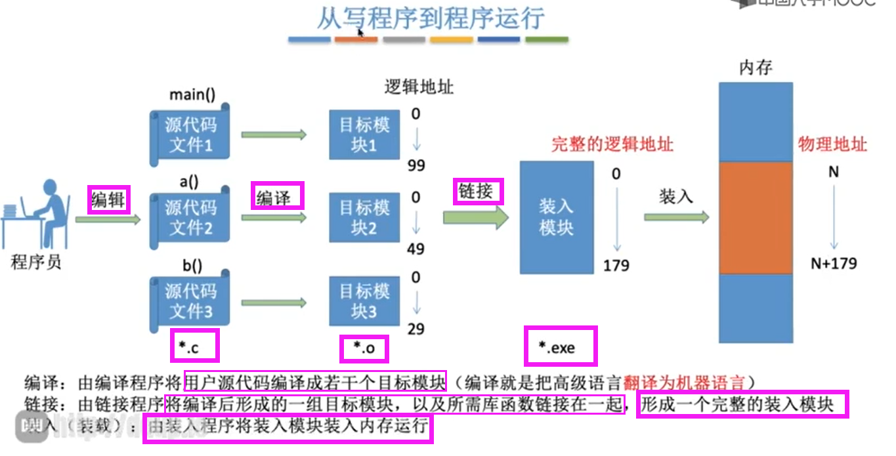  

## 1.2 链接的类型

  

## 1.3 装入模式(地址转换)

  

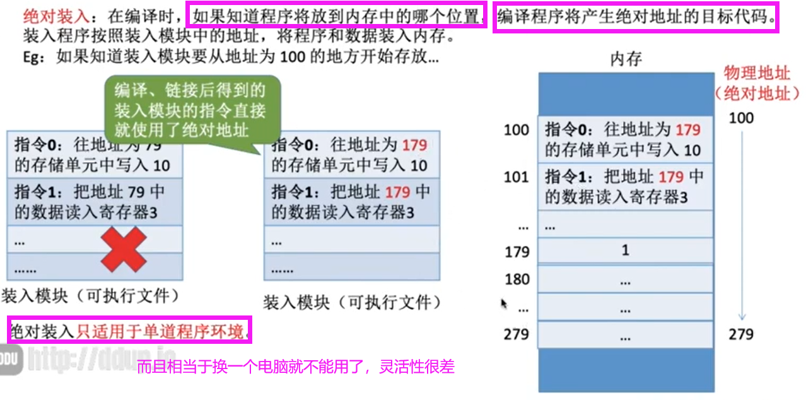  
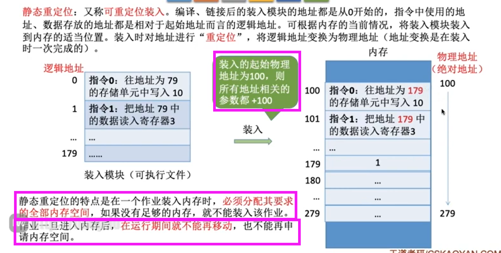  
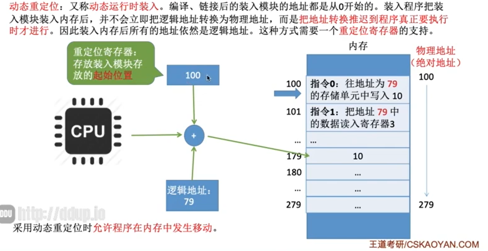  

# 2. 内存管理的概念 + 内存保护、扩充

>   - **内存管理**
>     - 内存分配和内存回收
>     - 内存保护
>       - 确保每道用户程序都只在自己的内存空间内运行，彼此互不干扰
>       - 方法①：设置一对**上下限寄存器**
>       - 方法②：**重定位寄存器**（又称**基址寄存器**）与**界地址寄存器**（又称**限长寄存器**）进行越界检查
>           - 重定位寄存器：`起始物理地址`
>           - 界地址寄存器：`最大逻辑地址`
>     - 地址映射
>       - 将地址空间中的**逻辑地址**转换为内存空间中与之对应的**物理地址**（见1.3）
>     - 内存扩充
>       - 从逻辑上去扩充内存容量，使用户所感觉到的内存容量比实际内存容量大得多  
>       - 方法①（用于早期`OS`）：**覆盖技术**——将程序分为多个段，常用的段常驻内存，不常用的段在需要时调入内存
>           - 内存中分一个**固定区**和若干个**覆盖区**
>           - 常用的段放在**固定区**，运行结束才会调出
>           - 不常用的段放在**覆盖区**，需要时调入内存，用不到时调出内存
>           - 按照逻辑结构，让不可能被同时访问的程序共享一个覆盖区
>       -  方法②：**交换技术**
>           - 把处于等待状态（或在CPU调度原则下被剥夺运行权利）的进程从内存移到辅存，把内存空间腾出来，这一过程又叫**换出**
>           - 把准备好竞争CPU运行的进程从辅存移到内存，这一过程又称为**换入**
>           - 外存的什么位置保存？什么时候交换？换出哪些进程？
>       -  方法③：**虚拟存储技术**

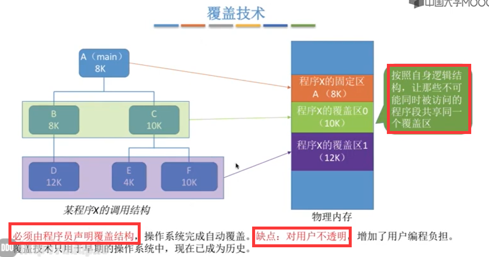  

  
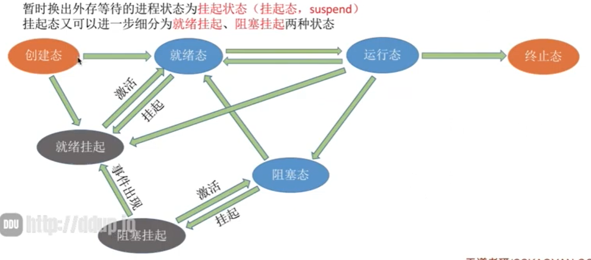  

  

# 3. 内存分配

## 3.1 连续分配

### 3.1.1 单一连续分配

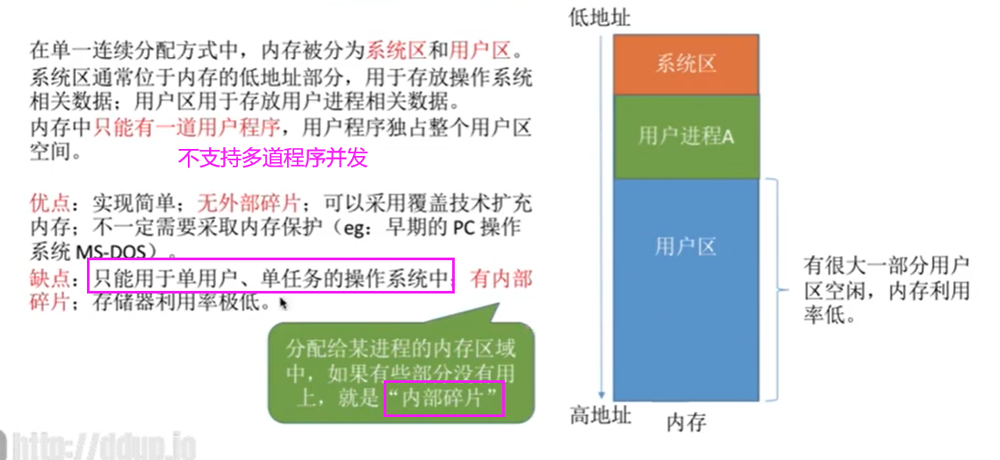  

### 3.1.2 固定分区分配

  
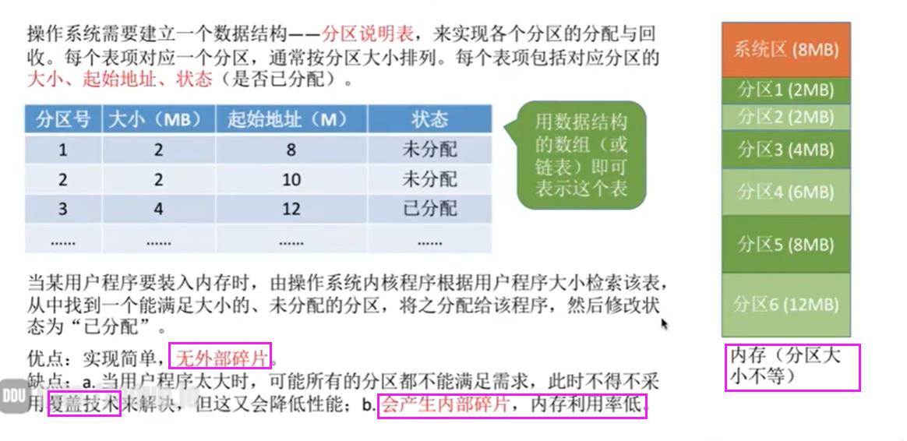  

### 3.1.3 动态分区分配
> - 不会预先将内存划分
> - 在进程装入内存时，根据进程的大小动态的建立分区，并使分区的大小正好适合进程的需要
> - 没有内部碎片，**但是有外部碎片**
>   - **内部碎片**：分配给某进程的内存区域中，有些部分没有用上
>   - **外部碎片**：内存中的某些空闲分区因**太小而难以利用**
> - 系统要用怎样的数据架构记录内存的使用情况？
> - 当很多个空闲分区都满足需求时，选择哪个分区进行分配？
> - 如何进行分区的分配和回收

#### a. 系统要用怎样的数据架构记录内存的使用情况？
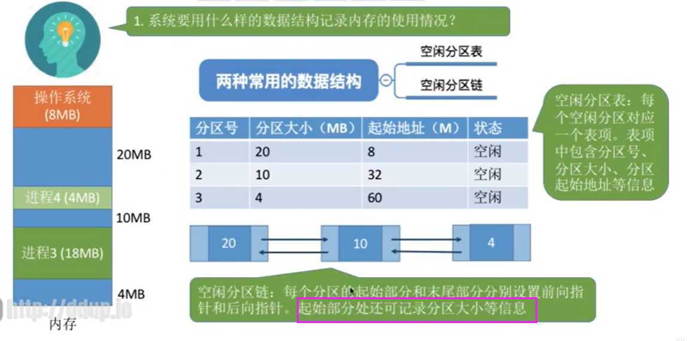  

#### b. 当很多个空闲分区都满足需求时，选择哪个分区进行分配？（动态分区分配算法）

#### c. 如何进行分区的分配和回收？

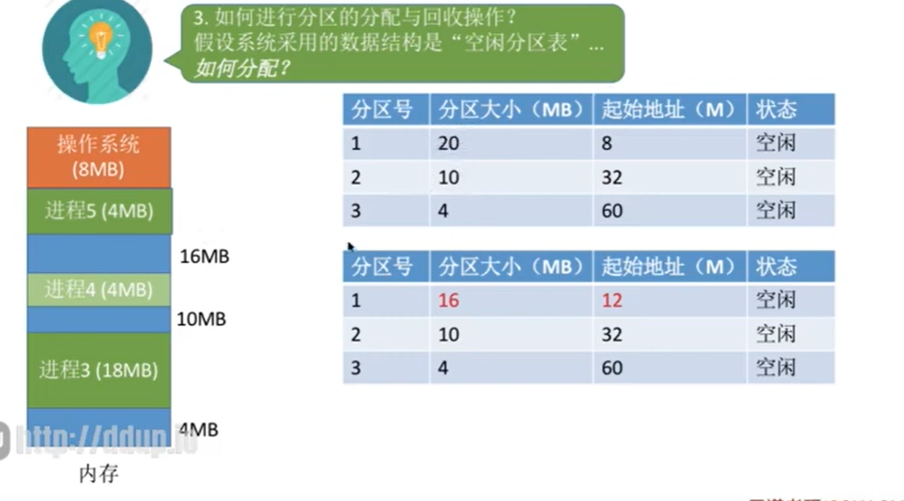  
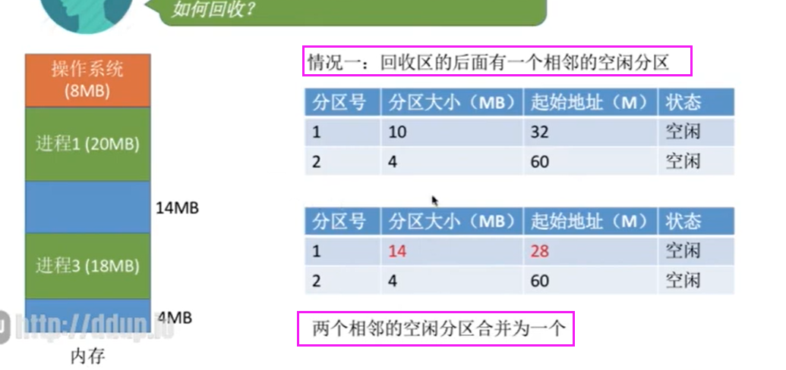  

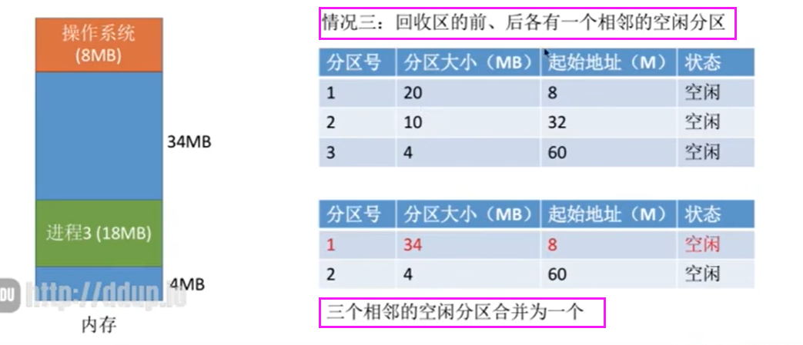  
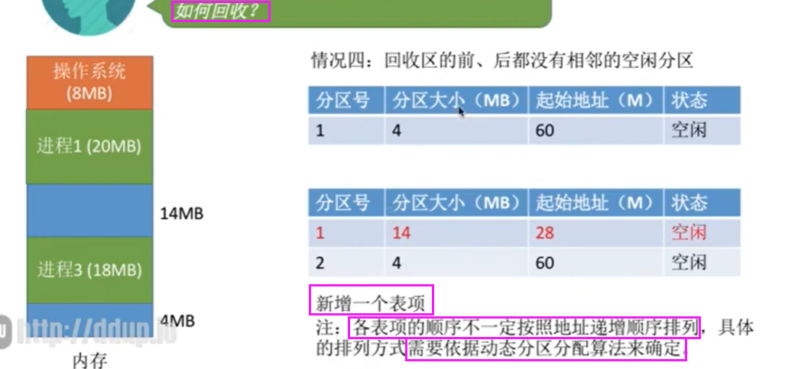  

## 3.2 离散分配