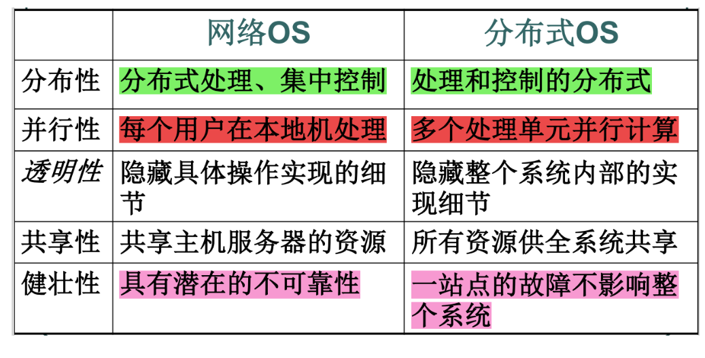

# CHAP 1
1. 操作系统的两大主要作用/设计操作系统的主要目的是什么？其特点有哪些？
> - 资源管理者（大管家、管理内容是四个章节）
> 
> - 扩展机器（为用户提供比实际机器更便于运用的抽象，包括进程、地址空间、文件等，提供接口）
> 
> - 并发、共享（互斥、同时【宏观上】）——两大基本特点
> 
> - 虚拟（时分复用：虚拟处理器、空分复用：虚拟存储）、异步（并发程序会争抢系统资源、但是资源有限）

2. 什么是多道程序设计
> 使同时进入计算机主存的几个相互独立的程序在管理程序控制之下相互交替地运行。
> 
> 当某道程序因某种原因不能继续运行下去时（如等待外部设备传输数据），管理程序便将另一道程序投入运行。
> 
> 这样可以使中央处理器及各外部设备尽量处于忙碌状态，从而大大提高计算机的使用效率
> 
> `CPU`、主存和`I/O设备`利用率；增加系统吞吐量

3. 分时、实时，网络操作系统、分布式操作系统的各自特点和相互联系

  
  

> 计算机网络是通过通信设施将物理上分散的、具有自治功能的多个计算机系统互连起来的，实现信息交换、资源共享、可互操作和协作处理的系统
> 
> 一个分布式系统就是通过网络连接的若干计算机的集合

4. 阐述系统调用过程

  

> - 操作系统接过控制权（在管态下），并分析“访管指令”中相关参数，让对应的“系统调用”子程序为用户服务
> 
> - 完成系统调用后，操作系统将CPU状态改变为目态，返回到用户程序继续执行

5. 操作系统的几种设计结构及其特点
> - 单体系统
>   - 整个系统在内核态以单一程序方式运行
>   -　主过程（处理服务过程）——服务过程（执行系统调用）——实用过程（辅助服务过程）
> - 层次式系统
>   - 上层软件都是在下一层的软件基础上构建
>   -　CPU分配与多道程序设计——>存储器和磁盘管理——>进程通信——>输入输出管理——>用户称修——>系统操作员
> - 微内核
> - 客户端－服务器

  

# CHAP 2
1. 作业调度和进程调度
> - 作业调度：
> - 进程调度
> - 对比
>   - **作业调度**是外存与内存之间的调度，发生频率很低，使进程从**创建态到就绪态**的过程
>   - 而**进程调度**是从内存到cpu的调度，发生频率很高，使进程从**就绪态到运行态**的过程

2. 进程与程序的区别和联系

> - 进程
>   - 程序作用在一组数据上的一次执行过程（一次计算）
>       - 而程序是可以永久存放于某种介质上的有序指令集合，是一个静态实体
>   - 操作系统中一个可独立调度和资源分配的基本单位
>       - 程序是不能作为调度运行和获得资源的基本单位的
>   - 并发性
>       - 多个进程的程序可以并发执行,而程序是不能并发执行的
>   - 异步性
>   - 结构特征
>       - 进程控制块`PCB`
>       - 程序段、数据段

3. 进程的状态及其变迁（并能说出原因）
  

4. 死锁发生的条件与解决死锁的方法

5. 进程实体的组成与组成部分的功能
  

6. 导致进程创建的4种主要事件和引起进程终止的条件

7. 线程与进程的联系与区别、线程的类型
  
> - a.用户级线程
>   - 用户自己创建的**逻辑上的线程**
>   - 多对一模型
> - b.内核级线程
>   - 一对一模型

  
