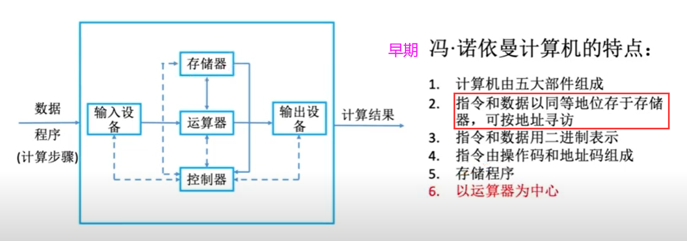
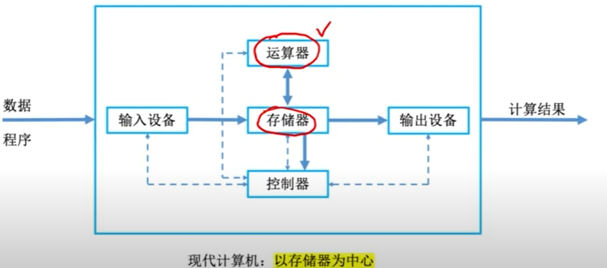
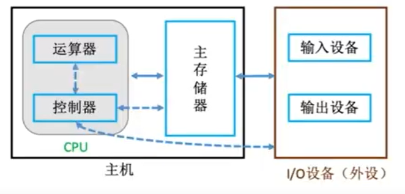
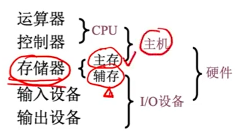
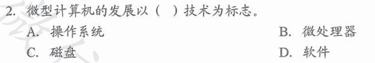
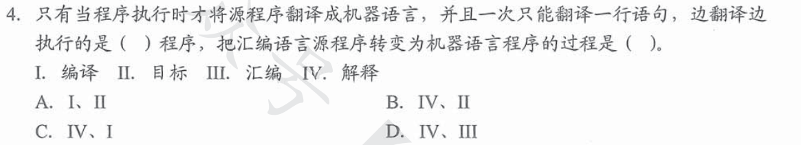
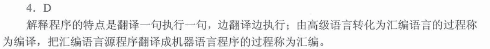

# 1.计算机系统发展

## 1.1 硬件发展
- 电子管时代
  - 第一台电子数字计算机
  - 机器语言
- 晶体管时代
  - 面向过程的语言：`FORTRAN`
  - OS雏形
- 中小规模集成电路
  - 元件集成在基片上
  - 分时操作系统
  - 半导体存储器
- 超大型集成电路
  - 微处理器出现
  - 并行、流水线、`Cache`、虚拟存储
  - 个人电脑`PC`萌芽，诞生了`Windows`、`MacOS`、`Linux`

## 1.2 软件发展
- 面向机器
  - 机器语言
  - 汇编语言
- 面向问题
  - `FORTRAN`、`PASCAL`、`C++`、`Java`

> 贝尔实验室：发明晶体管——>仙童半导体公司：发明集成电路——>`Intel`、`AMD`

# 2.计算机系统层次结构

- 硬件和软件在逻辑上是等效的

## 2.1 冯诺依曼计算机
- 早期冯诺依曼
  
- 现代计算机
  
> `I/O`操作尽可能的绕开`CPU`，实现`I/O设备`与存储器直接完成，从而**提高运行效率**
  

> 辅存属于外设
  

  
# 习题
## 题目
### 1.1
  
  

### 1.2

## 答案

### 1.1
  
  

### 1.2
