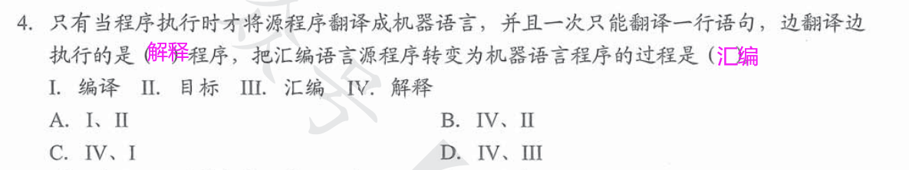
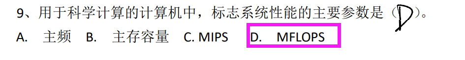

# 1.计算机系统发展

## 1.1 硬件发展

- 电子管时代
  - 第一台电子数字计算机
  - 机器语言
- 晶体管时代
  - 面向过程的语言：`FORTRAN`
  - OS雏形
- 中小规模集成电路
  - 元件集成在基片上
  - 分时操作系统
  - **半导体存储器**
- 超大型集成电路
  - **微处理器**出现
  - 并行、流水线、`Cache`、虚拟存储
  - 个人电脑`PC`萌芽，诞生了`Windows`、`MacOS`、`Linux`

## 1.2 软件发展

- 面向机器
  - 机器语言
  - 汇编语言
- 面向问题
  - `FORTRAN`、`PASCAL`、`C++`、`Java`

> 贝尔实验室：发明晶体管——>仙童半导体公司：发明集成电路——>`Intel`、`AMD`

# 2.计算机系统层次结构

- 硬件和软件在逻辑上是等效的

## 2.1 冯·诺依曼结构

- 早期冯诺依曼机
    
- 现代计算机
    
  
  > `I/O`操作尽可能的绕开`CPU`，实现`I/O设备`与存储器直接完成，从而**提高运行效率**
  >   

> 辅存属于外设

  

## 2.2 主存基本组成

  

- `MAR`位数：存储单元个数
- `MDR`位数：存储字长

## 2.3 运算器基本组成

  

## 2.4 控制器基本组成

  

## 2.5 计算机工作流程

- 具体步骤
1. 程序、数据装入主存

2. 从程序起始地址运行

3. 程序首地址取出指令——>指令译码——>指令执行——>完成功能并计算下一条指令地址

4. 得到新的地址———>读出下一条指令

5. 直到程序结束
- 信息流程

> 1. 取指令（记得`PC`+"1")
> `PC`——>`MAR`——>`M`（存储器）——>`MDR`——>`IR`
> `PC`+"1"
> 2. 分析指令（译码）
> `OP(IR)`——>`CU`
> 3. 执行指令
> `Ad(IR)`——>`MAR`——>`M`——>`MDR`——>`ACC`

## 2.6 多级层次结构

  
  

# 1.3 计算机性能指标

  

# 习题

  

  

  

  

  

  

  

  

  
  

  

  

  

 - 存储系统：主存、辅存、Cache
 - 计算机硬件链接方式：总线

  
