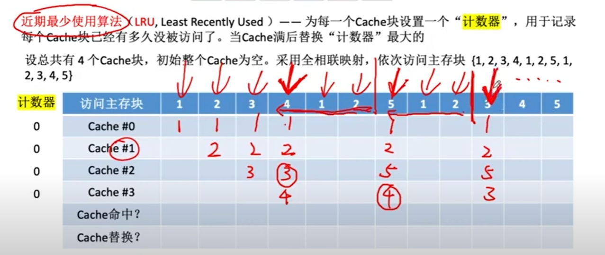
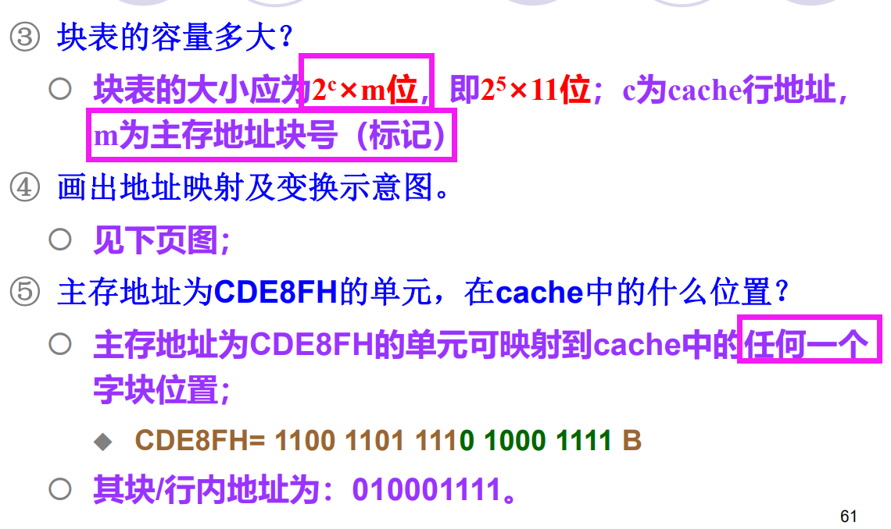

# 1. 存储器的分类
## 1.1 层次分类

  
- 辅存：**不可以**与`CPU`直接交互
- 主存：**可以**和`CPU`直接交互，也可以和`Cache`、辅存交换数据

## 1.2 介质分类
> - 磁表面存储器：磁盘、磁带
> - 半导体存储器：`MOS`管——主存、`Cache`
> - 光存储器：光盘

## 1.3 存储方式分类
> - 顺序存储器（`SAM`）——磁带
>   - 存取时间和存储单元的物理位置**有关**
> - 随机存储器（`RAM`）——半导体存储
>   - 存取时间和存储单元的物理位置**无关**
>   - 分为`静态RAM`（`SRAM`）和`动态RAM`（`DRAM`）
>       - `SRAM`：主要用于构成`Cache`，由`MOS`电路构成的**双稳触发器**保存二进制信息
>       - `DRAM`：主要用于构成主存，由`MOS`电路中的**栅极电容**保存二进制信息；
> - 半顺序存储器（`DAM`）——磁盘
>   - 存取时间**部分地依赖于**存储单元的物理位置
>       - 先直接选取信息所在区域
>       - 然后按顺序存储
> 

## 1.4 存储内容分类
> - 随机存储器（`RAM`）、只读存储器（`ROM`）
>   - 相同点
>       - 随机读取
>       - 半导体存储器
>   - 不同点
>       - RAM 随机存取，读写方便————ROM 只能读不能写
>       - RAM 用于主存、Cache————ROM 用于主存和`CPU`，存储固定不变的程序，如控制存储器`CM`

## 1.5 信息保存行
> - 易失性存储
>   - `RAM`
>   - 断电后，无法保持信息
> - 非易失性存储
>   - 只读存储器`ROM`
>       - 只读不能写
>    - 可编程序的只读存储器`PROM`
>      - 一次性写入
>    - 可擦可编程序的只读存储器`EPROM`
>       - 可多次写入、读出
>   - 可电擦可编程序只读存储器`E2PROM`
>     - 可多次读出但写入次数有限
>   - 快擦除读写存储器`Flash Memory`
>     - 重复写入、读出

# 2. 存储容量的扩展

  

## 2.1 连接原理
- 多块主存的存储芯片与`CPU`连接
   - 控制总线
   - 数据总线
   - 地址总线

## 2.2 位扩展（位扩并）
  

## 2.3 字扩展——存储芯片地址分配和片选（字扩串）

  

  

  

## 2.4 字位同时扩展

  

# 3. Cache

## 3.1 基本原理
  

  

## 3.2 `Cache`映射

  

  

## 3.3 `Cache`替换算法

- 直接映射不需要考虑替换算法

  

  

  

  

  

## 3.4 Cache写策略——数据一致性问题

   

# 4. 补充概念

## 4.1 虚拟存储的概念

  

  

## 4.2 大端和小端
>-  **Little**-Endian就是**低位字节排放在内存的低地址端**，高位字节排放在内存的高地址端。
>-  **Big**-Endian就是**高位字节排放在内存的低地址端**，低位字节排放在内存的高地址端。

## 4.3 DRAM刷新方法

  

- 用了行列地址

  

## 4.4 RAM读写周期

  

## 4.5 存储器性能指标

  

## 4.6 多模块存储器（空间并行）与存储周期

- 存储周期
  - 存储器连续启动两次独立的访问操作所需的最小间隔时间
  - `存取周期=存取时间+复原时间`

- 多模块存储器（空间并行）
  

# 习题

  

  

  

  

  

  
  
  

  
  
  

  
 

  

  
  

> - **微程序===指令>>>微指令>>>multiple 微命令 === 微操作**