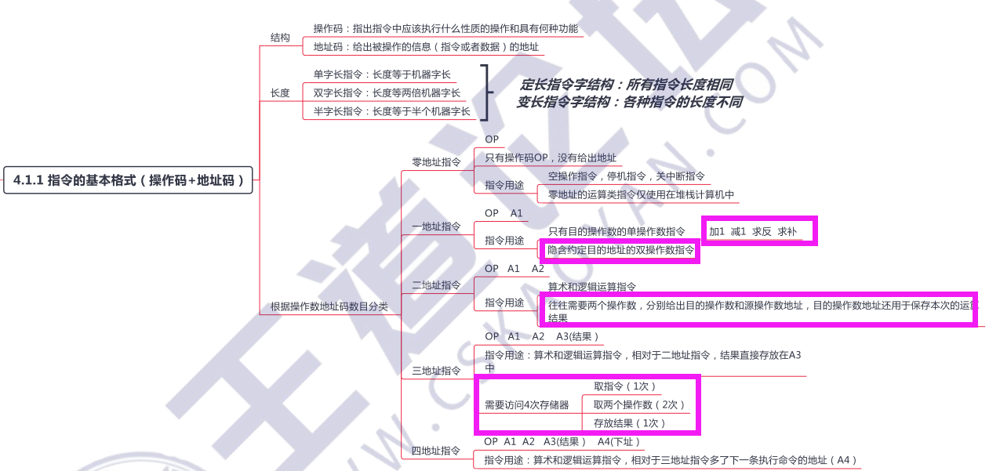
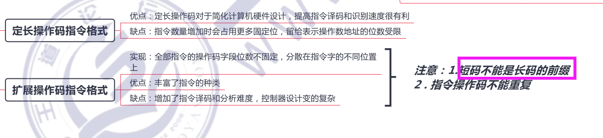
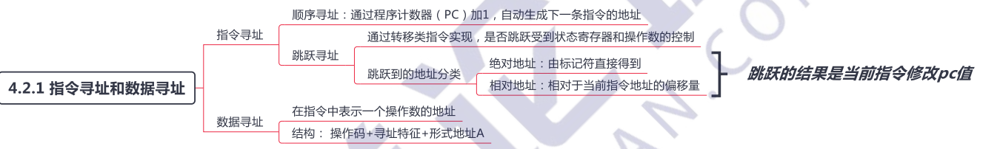
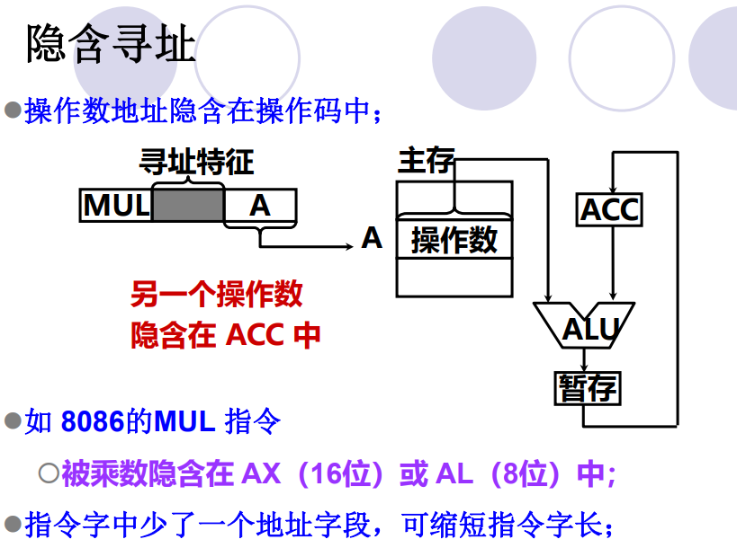
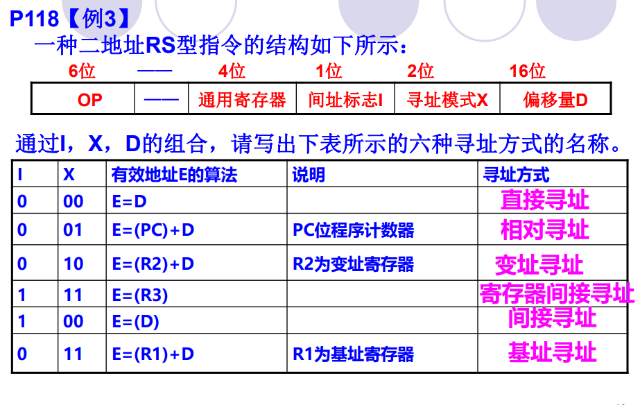
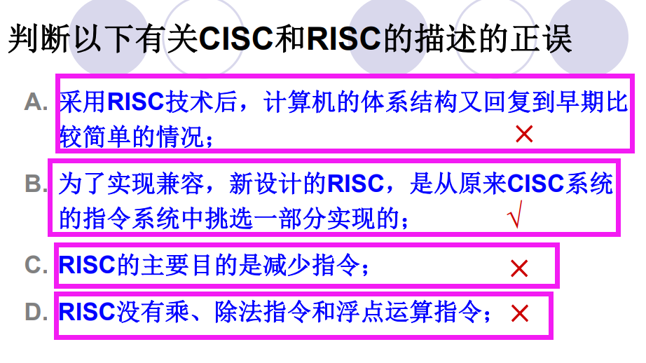
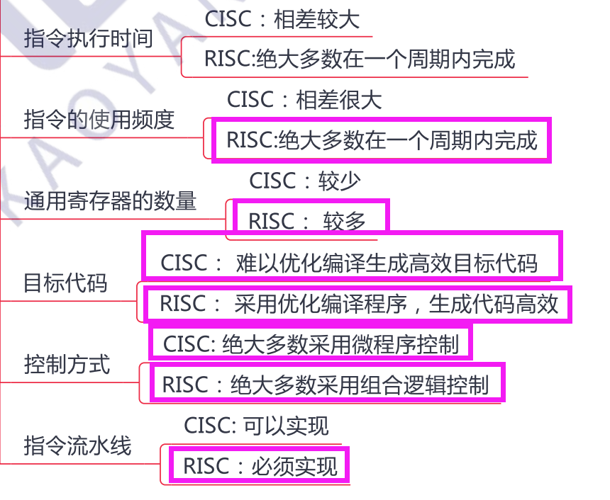

# 1.指令系统的发展与性能要求

# 2.指令格式
  

  

# 3.寻址

  

  

  

# 4.CISC和RISC
> - `RISC`：`reduced instruction set computer`,既**精简**指令系统
> - `CISC`：`Complex Instruction Set Computer`，既**复杂**指令系统

  
  

# 习题
  