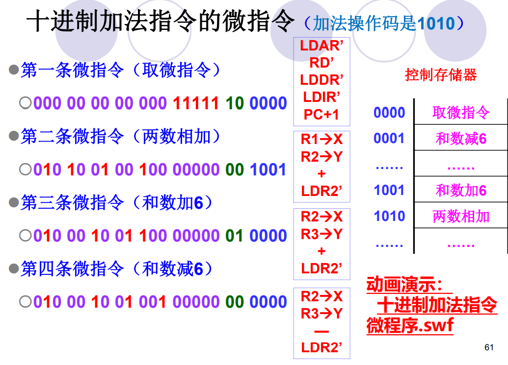

# 1. CPU的功能、组成、结构
## 1.1 功能
> - 指令控制——程序的顺序控制
>   - 取指令
>   - 分析指令
>   - 执行指令
> - 操作控制——产生和发送各操作信号
>   -  对指令操作码译码后产生控制信号
>   - 一条指令的功能往往由若干操作信号的组合来实现
> - 时间控制——维持各类操作的时序关系
>   - 各类操作有先有后
> - 数据加工——对数据进行算术逻辑运算
> - 中断处理
>   - 对计算机运行过程中出现的异常情况和特殊请求进行处理

## 1.2 组成
  

## 1.3 CPU的结构
  

  

> - 程序状态条件寄存器（`PSW`）
>   - 每个信号由一个触发器保存，从而拼成一个寄存器
> - 地址寄存器（`AR`）
>   - 主要用于**解决**主存/外设和`CPU`之间的**速度差异**，使地址信息可以保持到主存/外设的读写操作完成为止
> - **数据缓冲寄存器**（`DR`）
>   - 暂时存放`CPU`与外界传送的数据
>   - 作为`CPU`和内存、外部设备之间信息传送的中转站
>   - 补偿`CPU`和内存、外围设备之间在操作速度上的差别
> - 程序计数器（`PC`）
>   - 顺序执行：` PC+1→PC`——计数功能
>   - 转移执行： `(指令OPR)→PC`——寄存功能

# 2. 指令执行过程

## 2.1 基本概念
  

  

  

> - 比起取指令时候的访存，指令译码在`CPU`内部，十分快速，因此都划分为取指周期
>   - 展示的只是**必有**的**机器周期**
- 机器周期类别（指令周期的组成）
  - 一个基本的CPU周期包含4个时钟周期，对于某些`CPU`周期可以包含更多的时钟周期

  

  

## 2.2 指令周期的数据流

- 取值周期数据流向

  

- 取值周期数据流向
  - `EA`：有效地址

  

- 执行周期
  - 没有统一的数据流向
  
- 中断周期（略）

## 2.3 不同指令的指令周期

> - 寄存器-寄存器（`RR`）型指令：从寄存器中取操作数，把操作结果放到另一寄存器中，不需要访问内存存储器，因此速度快
> - 存储器—存储器（`SS`）型指令：执行此类指令，既要访问内存单元，又要访问寄存器
> - 寄存器-存储器（`RS`）型指令：执行此类指令，既要访问内存单元，又要访问寄存器

 
   

- `MOV R0 , R1`
  - 一条`RR型`指令，它需要**2**个`CPU`周期
  - 取指周期
    - `PC→ABUS→指令Cache` ，译码并启动
    - 指令`Cache → IR`
    - `PC→ PC+1`
    - `IR`中的操作码被译码或测试，`CPU`识别出是指令`MOV`
  - 执行指令
    - `R1→ALU`，`R1`中数据通过`ALU`传送
    - `ALU→ DBUS →DR→R0`，`ALU`输出，`DR`锁存，`R0`写

  

- `LAD R1 , 6`——直接访存指令
  - 一条`RS型`指令，它需要**3**个`CPU`周期
  - 取指周期
    - 类似`MOV`
  - 执行指令
    - 寻址
      - `IR→ DBUS→ AR`
    - `AR→ABUS→数据Cache` ，译码并启动
    - `数据Cache → DBUS → DR→R1`，`数据Cache`读，`DR`锁存，`R1`写

  

- `ADD R1 , R2`
  - `RR型`指令，需要**2**个`CPU`周期
  - 取指周期
    - 类似`MOV`
  - 执行指令
    - `R1、R2→ALU`
    - `ALU`做加运算，将两数相加
    - `ALU→DBUS→DR→R2`，保存结果，`ALU`输出，`DR`锁存，`R2`写

- `STO R2 , (R3)`
  - `RS`型指令，需要**2**个`CPU`周期
  - 取指周期
    - 类似`MOV`
  - 执行指令
    - 间址
      - 根据`R3`中的地址寻址所要访问的存储单元
      - `R3→DBUS→AR`，发出地址启动`数据Cache`，`R3`读，`AR`锁存
    - `R2→DBUS→数据Cache`

- `JMP 101`
  - 无条件转移指令，改变程序的执行顺序
  - 取指周期（略）
  - 执行周期
    - `IR→DBUS→PC`

# 3. 数据通路

  

# 4. 控制器的功能与原理
## 4.1 基本概念
> - `CU`发出一个`微命令`，可完成对应的`微操作`
> - 每一个节拍其实可以**并行**完成**不冲突、相容的**的`微操作`

  

> - 根据设计方法不同，操作控制器可分为
>   - 硬布线控制器 采用时序逻辑技术实现
>   - 微程序控制器 采用存储逻辑实现
>   - 前两种方式的结合

- `微操作`分类
  - 相容性`微操作`
    - 在同时或同一个`CPU`周期内可以并行执行的`微操作`
  - 相斥性`微操作`
    - 不能在同时或不能在同一个`CPU`周期内并行执行的`微操作`
## 4.2 硬布线控制器

- 简而言之就是纯硬件（电路）设计的控制器
  

  

## 4.3 微程序控制器

### 4.3.1 设计思路
> - `微操作`序列之于指令，如同指令序列之于程序
> - `微指令`：完成几个`微操作`
>   - `微指令`是对`指令`执行步骤的描述
>     - `指令`是对程序执行步骤的描述
>   - `指令`是对`微指令`功能的**封装**
> - `微程序`：由`微指令`序列组成，**每一种指令对应一个微程序**
> - 一个`微命令`对应一根输出线
>   - `微命令`与`微操作`一一对应
> - 采用**存储程序**的思想，在出厂前就把所有指令的“**微程序**”存入“**控制器存储器**”中
  

 

  

  
 

### 4.3.2 基本结构

  

  

  
  
  

### 4.3.3 微指令格式

   

### 4.3.4 微指令编码
> 译码器：较少输入变为较多输出

#### 直接编码
  

#### 字段直接编码
  

  
  
 

#### 字段间接编码

  

### 4.3.5 微指令地址形成方式

> **计数器**、**多路转移**
  

  

## 4.4 对比

  

# 5. 流水线

> - `CISC`可以通过优化实现流水线
> - `RISC`必须要实现流水线
## 5.1 流水线分类

  

  

## 5.2 指令流水线
  

## 5.3 性能指标

  

  

  

## 5.4 超标量流水线
- 具有2条以上的指令流水线
- 
  
