# 1. 磁表面存储器
> - 切割磁感线
> - 既可以输出，也可以输出

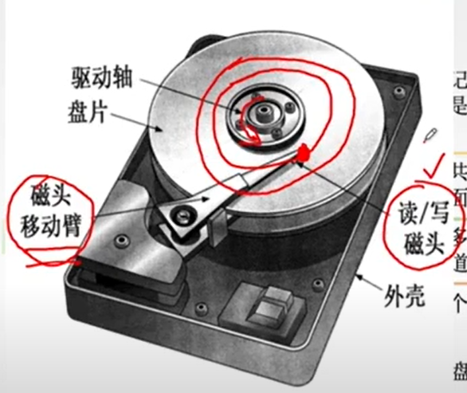  

## 1.1 组成

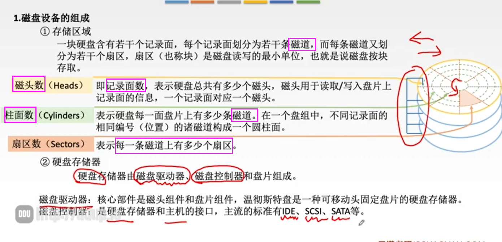  

##　1.2 性能指标
> - 格式化：留下某些扇区作为损坏后的备用区
> - 磁盘的性能会受到最内侧`位密度`的制约
> - 读写以扇区为单位（？

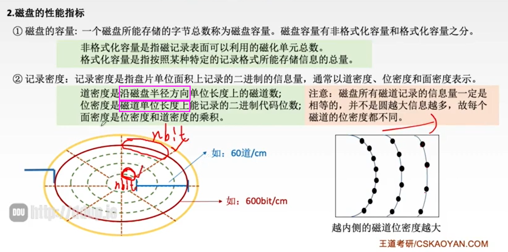  

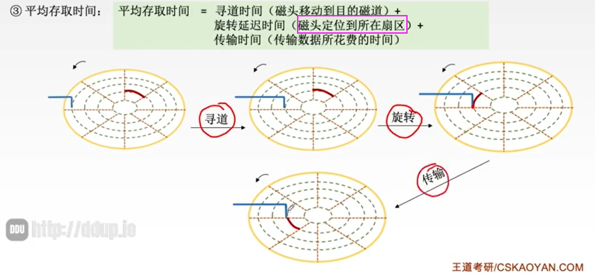  

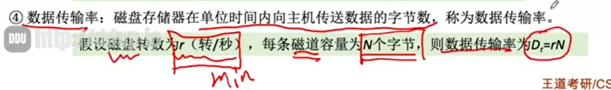  

## 1.3 磁盘地址与工作流程

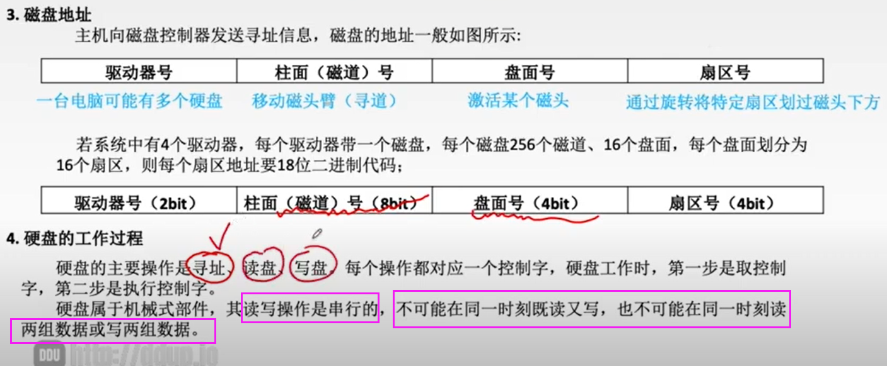  

## 1.4 RAID

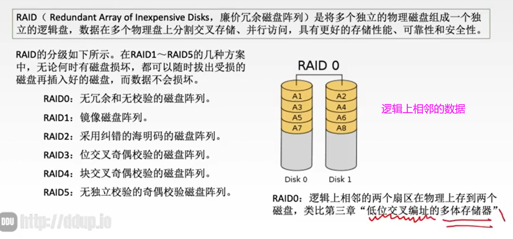  

# 2. 显示设备

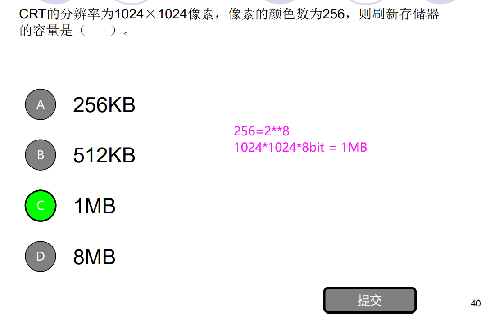  

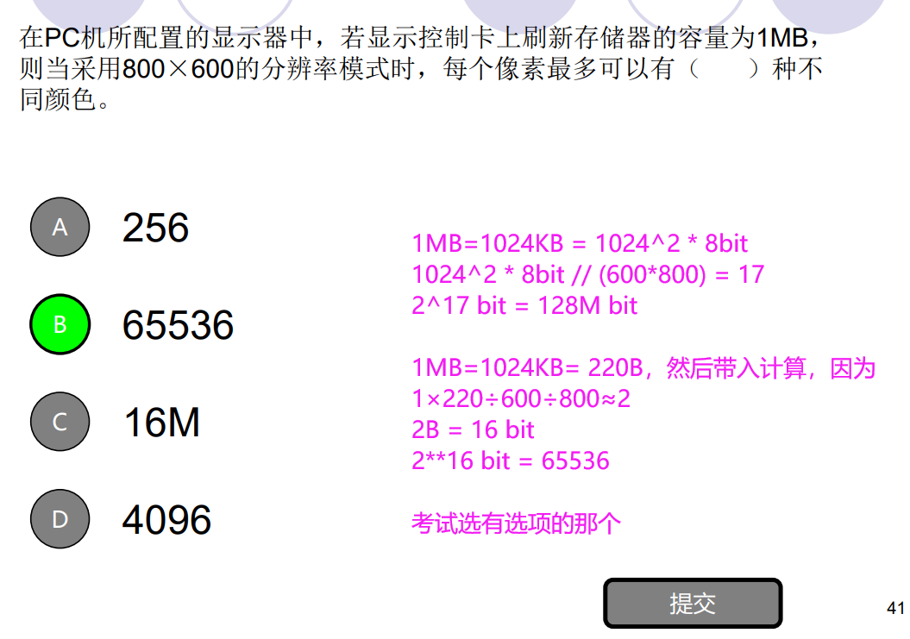  

# 3. I/O设备
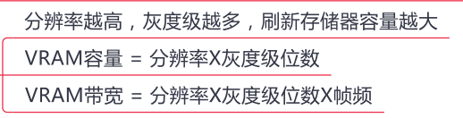  

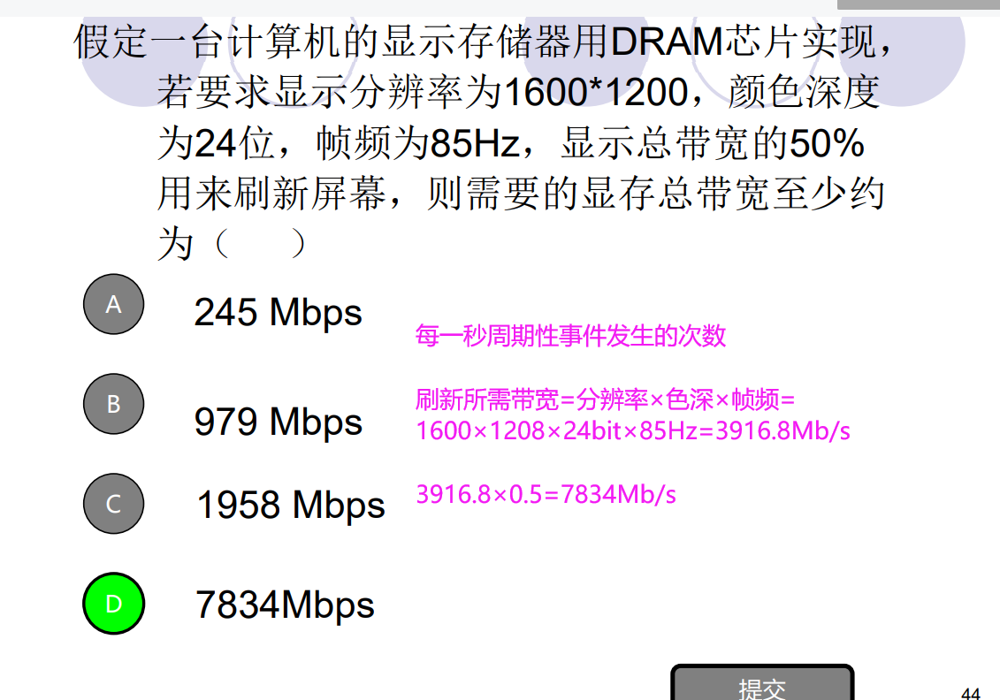  
